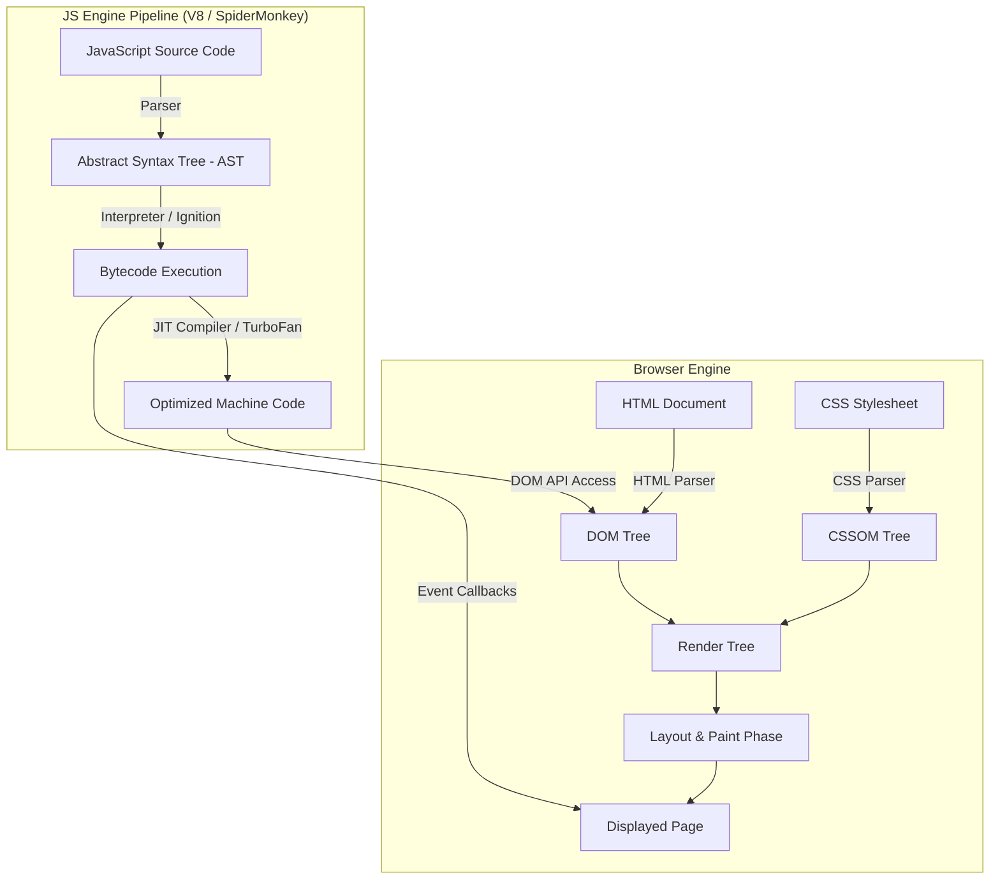

# JavaScript Introduction & Fundamentals

> **Classification:** `JavaScript / 01-Fundamentals`  
> **Primary Reference:** [MDN Web Docs - JavaScript](https://developer.mozilla.org/en-US/docs/Web/JavaScript) & [ECMA-262 Specification](https://tc39.es/ecma262/)  

---

## 1. Executive Summary

* **Definition**: High-level, prototype-based, multi-paradigm, dynamic programming language.
* **The Web Tri-Pillar**:
  * **HTML**: Defines content & DOM structure.
  * **CSS**: Controls presentation & visual styling.
  * **JavaScript**: Provides dynamic behavior, event handling, and logic.
* **Runtime Environments**: Executes client-side inside browser engines (V8, SpiderMonkey) and server-side via Node.js / Deno / Bun.

---

## 2. Core Capabilities

* **DOM Mutation**: Dynamically updates text, HTML markup, and page elements at runtime.
* **Attribute Control**: Modifies HTML attributes (`src`, `href`, `disabled`, `class`) on the fly.
* **CSS & Style Toggling**: Controls inline styling, dynamic classes, and animation states.
* **Asynchronous Networking**: Communicates with remote servers via Fetch API / AJAX without page reloads.

---

## 3. Visual Architecture & Flowcharts



---

### Script Loading Strategies Comparison

```mermaid
gantt
    title Script Execution Strategies Timeline
    dateFormat  X
    axisFormat %s

    section Default (script src)
    HTML Parsing         :active, p1, 0, 30
    Fetch Script         :crit, s1, 30, 60
    Execute Script       :crit, e1, 60, 80
    Resume HTML Parsing  :active, p2, 80, 100

    section Async (script async src)
    HTML Parsing & Fetch :active, ap1, 0, 50
    Pause & Execute JS   :crit, ae1, 50, 70
    Resume HTML Parsing  :active, ap2, 70, 100

    section Defer (script defer src)
    HTML Parsing & Fetch :active, dp1, 0, 70
    Execute JS after DOM :crit, de1, 70, 90
    DOM Complete         :done, dc, 90, 100
```



---

## 4. Practical Code Examples

<details open>
<summary><strong>💻 Click to Hide/Show Code Example: Dynamic HTML Content Modification</strong></summary>
<br>

```html
<!DOCTYPE html>
<html lang="en">
<head>
    <meta charset="UTF-8">
    <title>Dynamic Text Demo</title>
</head>
<body>

    <h2 id="demo">JavaScript can change HTML content.</h2>

    <!-- Triggering inline function on click -->
    <button type="button" onclick='document.getElementById("demo").innerHTML = "Hello JavaScript!"'>
        Click Me!
    </button>

</body>
</html>
```
</details>

<details open>
<summary><strong>💻 Click to Hide/Show Code Example: Attribute Manipulation (Image Switcher)</strong></summary>
<br>

```html
<!DOCTYPE html>
<html lang="en">
<head>
    <meta charset="UTF-8">
    <title>Attribute Toggle Demo</title>
</head>
<body>

    <h2>JavaScript Image Attribute Control</h2>

    <button onclick="document.getElementById('myImage').src='pic_bulbon.gif'">Turn on the light</button>

    

    <button onclick="document.getElementById('myImage').src='pic_bulboff.gif'">Turn off the light</button>

</body>
</html>
```
</details>

<details open>
<summary><strong>💻 Click to Hide/Show Code Example: Modifying Styles & Controlling Visibility</strong></summary>
<br>

```html
<!DOCTYPE html>
<html lang="en">
<head>
    <meta charset="UTF-8">
    <title>Style & Visibility Control</title>
</head>
<body>

    <p id="styleText">JavaScript can change element styling and visibility.</p>

    <!-- Changing Font Size & Color -->
    <button type="button" onclick="document.getElementById('styleText').style.fontSize='25px'; document.getElementById('styleText').style.color='crimson';">
        Change Style
    </button>

    <!-- Hiding Element -->
    <button type="button" onclick="document.getElementById('styleText').style.display='none'">
        Hide Text
    </button>

    <!-- Showing Element -->
    <button type="button" onclick="document.getElementById('styleText').style.display='block'">
        Show Text
    </button>

</body>
</html>
```
</details>

<details open>
<summary><strong>💻 Click to Hide/Show Code Example: External JavaScript Inclusion</strong></summary>
<br>

```javascript
// File: script.js
function greetUser() {
    const heading = document.getElementById("welcomeHeading");
    heading.textContent = "Welcome to Modern JavaScript Execution!";
    heading.style.color = "#04AA6D";
}
```

```html
<!-- File: index.html -->
<!DOCTYPE html>
<html lang="en">
<head>
    <meta charset="UTF-8">
    <title>External JS Example</title>
    <script src="script.js" defer></script>
</head>
<body>

    <h1 id="welcomeHeading">Original Title</h1>
    <button onclick="greetUser()">Trigger External Script</button>

</body>
</html>
```
</details>

---

## 5. Key Takeaways & Pitfalls

> [!NOTE]
> **Separation of Concerns**: Avoid inline event handlers (`onclick=""`). Use `addEventListener()` in external JS files.

> [!IMPORTANT]
> **JavaScript ≠ Java**: Java is a statically-typed, compiled JVM language. JavaScript is a dynamically-typed scripting runtime.

> [!WARNING]
> **DOM Availability**: Accessing elements before DOM parsing finishes throws `TypeError: Cannot set property of null`. Use `<script defer>`.

---

## 6. Technical References

* 📖 [MDN Web Docs - JavaScript First Steps](https://developer.mozilla.org/en-US/docs/Learn/JavaScript/First_steps)
* 📜 [ECMA-262 Language Specification](https://tc39.es/ecma262/)
* 🛠️ [V8 JavaScript Engine Documentation](https://v8.dev/)

---

<div align="center">

<a href="https://ashwanitiwari.com/portfolio">
  
</a>

<br />

**Documented & Maintained by [Ashwani Tiwari](https://ashwanitiwari.com)**  
*Explore full-stack architecture, projects, and client work at [ashwanitiwari.com/portfolio](https://ashwanitiwari.com/portfolio)*

</div>
