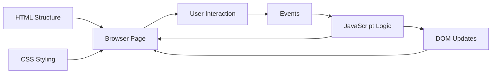
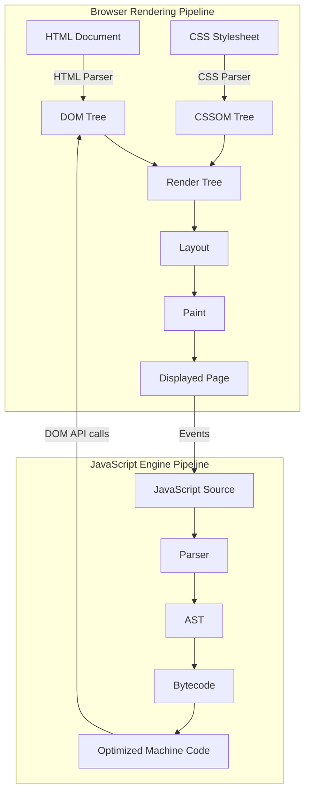

# JavaScript Introduction & Fundamentals

<div align="center">


**JavaScript is the execution layer of the web: it turns static documents into reactive, stateful, user-driven interfaces.**

</div>

---

## ⚡ Command Center

| Signal | High-Value Summary |
| :--- | :--- |
| **Language Role** | Adds behavior, decision-making, DOM updates, event handling, and async communication to web pages. |
| **Execution Model** | Source code is parsed, interpreted, optimized, and executed by a JavaScript engine. |
| **Web Relationship** | HTML provides structure, CSS provides presentation, JavaScript provides interaction. |
| **Runtime Targets** | Browser engines, Node.js, Deno, Bun, embedded runtimes, and automation environments. |

> [!IMPORTANT]
> Think of JavaScript as the **control system** of a page. It reads user intent, updates application state, and tells the browser what must change visually.

---

## 🧠 Mental Model



| Layer | Responsibility | JavaScript Touchpoint |
| :--- | :--- | :--- |
| **HTML** | Document structure | Select nodes, read content, update markup |
| **CSS** | Visual presentation | Toggle classes, update inline styles, trigger animation states |
| **DOM** | Runtime object tree | Query, mutate, create, remove, and react to elements |
| **Browser APIs** | Platform capabilities | Events, storage, fetch, timers, dialogs, printing |

---

## 🚀 Core Capabilities

| Capability | What It Enables | Common APIs |
| :--- | :--- | :--- |
| **DOM Mutation** | Change page content without reloads | `textContent`, `innerHTML`, `append()` |
| **Attribute Control** | Update images, links, states, accessibility metadata | `src`, `href`, `setAttribute()` |
| **Style Control** | Change visual state from logic | `style`, `classList.add()`, `classList.toggle()` |
| **Events** | React to clicks, input, keyboard, and lifecycle moments | `addEventListener()` |
| **Async Work** | Communicate with services in the background | `fetch()`, `Promise`, `async` / `await` |

---

## 🏗️ Engine & Rendering Flow



> [!TIP]
> Modern JavaScript performance is usually about **reducing unnecessary DOM work**, batching visual updates, and avoiding parser-blocking scripts.

---

## ⏱️ Script Loading Snapshot


| Strategy | Best Use | Risk |
| :--- | :--- | :--- |
| **Default script** | Critical blocking setup | Delays HTML parsing |
| **`async`** | Independent analytics or widgets | Execution order is not guaranteed |
| **`defer`** | Main application scripts | Usually the best default for DOM-dependent code |

---

## 💻 Practical Code Lab

<details open>
<summary><strong>💻 Click to Hide/Show Code Example</strong></summary>
<br>

```html
<!DOCTYPE html>
<html lang="en">
<head>
    <meta charset="UTF-8">
    <title>Dynamic Text Demo</title>
</head>
<body>

    <h2 id="demo">JavaScript can change HTML content.</h2>

    <!-- Triggering inline function on click -->
    <button type="button" onclick='document.getElementById("demo").innerHTML = "Hello JavaScript!"'>
        Click Me!
    </button>

</body>
</html>
```
</details>

<details open>
<summary><strong>💻 Click to Hide/Show Code Example</strong></summary>
<br>

```html
<!DOCTYPE html>
<html lang="en">
<head>
    <meta charset="UTF-8">
    <title>Attribute Toggle Demo</title>
</head>
<body>

    <h2>JavaScript Image Attribute Control</h2>

    <button onclick="document.getElementById('myImage').src='pic_bulbon.gif'">Turn on the light</button>

    

    <button onclick="document.getElementById('myImage').src='pic_bulboff.gif'">Turn off the light</button>

</body>
</html>
```
</details>

<details open>
<summary><strong>💻 Click to Hide/Show Code Example</strong></summary>
<br>

```html
<!DOCTYPE html>
<html lang="en">
<head>
    <meta charset="UTF-8">
    <title>Style & Visibility Control</title>
</head>
<body>

    <p id="styleText">JavaScript can change element styling and visibility.</p>

    <!-- Changing Font Size & Color -->
    <button type="button" onclick="document.getElementById('styleText').style.fontSize='25px'; document.getElementById('styleText').style.color='crimson';">
        Change Style
    </button>

    <!-- Hiding Element -->
    <button type="button" onclick="document.getElementById('styleText').style.display='none'">
        Hide Text
    </button>

    <!-- Showing Element -->
    <button type="button" onclick="document.getElementById('styleText').style.display='block'">
        Show Text
    </button>

</body>
</html>
```
</details>

<details open>
<summary><strong>💻 Click to Hide/Show Code Example</strong></summary>
<br>

```javascript
// File: script.js
function greetUser() {
    const heading = document.getElementById("welcomeHeading");
    heading.textContent = "Welcome to Modern JavaScript Execution!";
    heading.style.color = "#04AA6D";
}
```

```html
<!-- File: index.html -->
<!DOCTYPE html>
<html lang="en">
<head>
    <meta charset="UTF-8">
    <title>External JS Example</title>
    <script src="script.js" defer></script>
</head>
<body>

    <h1 id="welcomeHeading">Original Title</h1>
    <button onclick="greetUser()">Trigger External Script</button>

</body>
</html>
```
</details>

---

## 🎯 Production Rules

> [!NOTE]
> **Separation of Concerns:** Prefer external JavaScript files and `addEventListener()` over inline event attributes in production interfaces.

> [!WARNING]
> **DOM Timing:** Accessing an element before it exists returns `null`. Use `defer`, place scripts after markup, or wait for DOM readiness.

> [!IMPORTANT]
> **JavaScript is not Java:** JavaScript is dynamic and prototype-based; Java is statically typed and class-based.

---

## ✅ Fast Recall

| Remember | Why It Matters |
| :--- | :--- |
| **JavaScript owns behavior** | It transforms static UI into interactive systems. |
| **DOM access must be timed** | Early execution causes missing-node errors. |
| **`defer` is the modern default** | It keeps parsing smooth and runs after the DOM is ready. |
| **Avoid inline handlers** | Cleaner architecture, easier testing, safer maintenance. |

---

<div align="center">

<a href="https://ashwanitiwari.com/portfolio">
  
</a>

<br />

**Documented & Maintained by [Ashwani Tiwari](https://ashwanitiwari.com)**  
*Explore full-stack architecture, projects, and client work at [ashwanitiwari.com/portfolio](https://ashwanitiwari.com/portfolio)*

</div>
