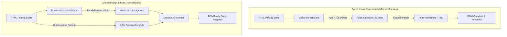

```mermaid
gantt
    title Browser Script Attribute Matrix
    dateFormat X
    axisFormat %s

    section Default (script)
    HTML Parsing         :active, p1, 0, 30
    Download & Exec JS   :crit, e1, 30, 70
    Resume HTML Parsing  :active, p2, 70, 100

    section Async (script async)
    HTML Parsing         :active, ap1, 0, 40
    Download JS (Bg)     :done, ad1, 0, 40
    Pause & Exec JS      :crit, ae1, 40, 60
    Resume HTML Parsing  :active, ap2, 60, 100

    section Defer (script defer)
    HTML Parsing (Full)  :active, dp1, 0, 80
    Download JS (Bg)     :done, dd1, 0, 50
    Execute JS           :crit, de1, 80, 100
```

# Script Placement & Execution Strategies

> **Classification:** `JavaScript / 01-Fundamentals`  
> **Primary Reference:** [HTML Living Standard - The Script Element](https://html.spec.whatwg.org/multipage/scripting.html#the-script-element) & [MDN Web Docs - <script>](https://developer.mozilla.org/en-US/docs/Web/HTML/Element/script)  

---

## 1. Executive Summary

* **`<script>` Tag**: Primary element used to embed or reference executable JavaScript code within HTML documents.
* **Placement Impact**: Location (`<head>` vs `<body>`) and attributes (`async`, `defer`) dictate HTML parsing, network fetch priority, and DOM availability.
* **Modern Standard**: Prefer **external scripts in `<head>` with `defer`** to decouple script execution from document parsing.

---

## 2. Parsing & Execution Lifecycle

Synchronous scripts halt HTML rendering while downloading and executing. Deferred scripts fetch in parallel and execute sequentially after DOM parsing completes.



---

## 3. Inclusion Methods & Placement

### 3.1 Internal Script Placement

* **In `<head>`**: Executes before DOM body instantiation. Used for early configuration or polyfills.
* **Before `</body>`**: Executes after DOM nodes exist. Prevents `null` reference errors in legacy setups.

<details open>
<summary><strong>💻 Click to Hide/Show Code Example: Internal Script Placement</strong></summary>
<br>

```html
<!DOCTYPE html>
<html lang="en">
<head>
    <meta charset="UTF-8">
    <title>Internal Script Placement</title>

    <!-- Script in <head>: Runs BEFORE DOM body is constructed -->
    <script>
        function getAppConfig() {
            return { version: "1.0.0", env: "production" };
        }
    </script>
</head>
<body>

    <h1 id="page-heading">Welcome</h1>

    <!-- Script at end of <body>: Runs AFTER DOM nodes are instantiated -->
    <script>
        document.getElementById("page-heading").textContent = "Dashboard Initialized";
    </script>
</body>
</html>
```
</details>

---

### 3.2 External Script References

* **Separation of Concerns**: Cleanly isolates business logic from HTML markup.
* **HTTP Cacheability**: Browser caches `.js` files, reducing bandwidth and load latency on subsequent visits.

<details open>
<summary><strong>💻 Click to Hide/Show Code Example: External Script References</strong></summary>
<br>

```html
<!-- Relative path reference -->
<script src="app.js" defer></script>

<!-- Subdirectory reference -->
<script src="assets/js/utils.js" defer></script>

<!-- Absolute CDN reference -->
<script src="https://cdn.example.com/libs/chart.min.js" defer></script>
```
</details>

---

### 3.3 Loading Attributes Matrix (`async` vs `defer`)

| Attribute | Download Behavior | Execution Timing | Execution Order | Primary Use Case |
| :--- | :--- | :--- | :--- | :--- |
| **None (Default)** | Blocks HTML Parser | Immediately after download | Sequential (Top-to-bottom) | Legacy scripts / critical polyfills |
| `defer` | Parallel with Parser | After DOM parsing finishes | Preserved document order | Main app logic, DOM modifiers |
| `async` | Parallel with Parser | Immediately when downloaded | Independent (First-come, first-serve) | Analytics, ads, tracking pixels |



---

## 4. Key Takeaways & Pitfalls

> [!NOTE]
> **HTTP Caching**: External scripts are cached by browser HTTP policies. Subsequent page visits load scripts instantly from browser disk cache.

> [!WARNING]
> **Avoid `async` for Dependencies**: `async` scripts execute out of order. If `app.js` relies on `library.js`, loading via `async` risks throwing `Uncaught ReferenceError`.

> [!TIP]
> **Modern Best Practice**: Place external scripts in `<head>` with `defer`. Enables early parallel downloads while guaranteeing non-blocking DOM parsing.

---

## 5. Technical References

* 📖 [MDN Web Docs - The Script Element](https://developer.mozilla.org/en-US/docs/Web/HTML/Element/script)
* 📜 [WHATWG HTML Specification - Scripting](https://html.spec.whatwg.org/multipage/scripting.html)
* ⚡ [Google Web Fundamentals - Efficiently Load JavaScript](https://web.dev/articles/efficiently-load-third-party-javascript)

---

<div align="center">

<a href="https://ashwanitiwari.com/portfolio">
  
</a>

<br />

**Documented & Maintained by [Ashwani Tiwari](https://ashwanitiwari.com)**  
*Explore full-stack architecture, projects, and client work at [ashwanitiwari.com/portfolio](https://ashwanitiwari.com/portfolio)*

</div>
