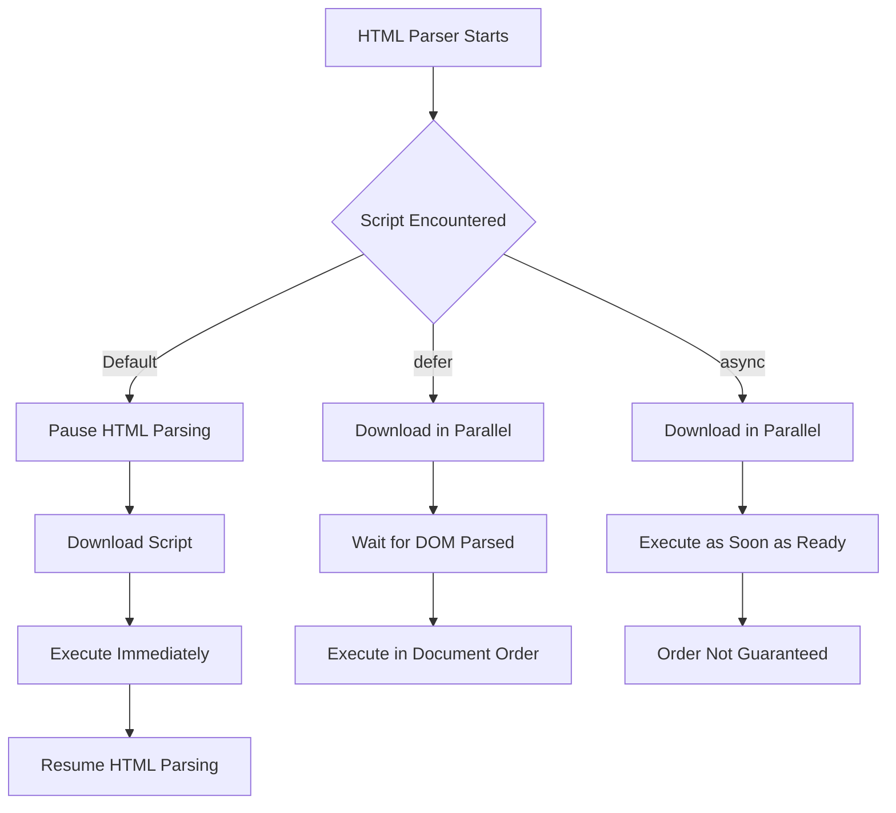

# Script Placement & Execution Strategies

<div align="center">


**Script placement decides when JavaScript interrupts parsing, when the DOM becomes available, and how fast the user sees a usable page.**

</div>

---

## ⚡ Execution Dashboard

| Decision | Recommended Default | Why It Wins |
| :--- | :--- | :--- |
| **Where to place app scripts** | `<head>` with `defer` | Starts download early and waits for DOM parsing before execution. |
| **When to use inline scripts** | Small boot config only | Keeps markup clean and avoids scattered behavior. |
| **When to use `async`** | Independent third-party-style scripts | Runs as soon as downloaded, without preserving order. |
| **When to avoid default scripts** | Most modern app code | Default scripts block the parser. |

> [!IMPORTANT]
> The browser parser is a production resource. Every blocking script makes the page wait before it can finish building the DOM.

---

## 🧠 Parser Mental Model



---

## 🧩 Placement Patterns

| Pattern | Use Case | Tradeoff |
| :--- | :--- | :--- |
| **Inline in `<head>`** | Early constants, feature flags, tiny setup | Can run before page elements exist. |
| **Inline before `</body>`** | Legacy DOM access | Works, but mixes behavior into markup. |
| **External with `defer`** | Main application logic | Clean, cacheable, DOM-safe. |
| **External with `async`** | Independent scripts | Fast but unpredictable order. |

---

## 💻 Code Lab: Internal Placement

<details open>
<summary><strong>💻 Click to Hide/Show Code Example</strong></summary>
<br>

```html
<!DOCTYPE html>
<html lang="en">
<head>
    <meta charset="UTF-8">
    <title>Internal Script Placement</title>

    <!-- Script in <head>: Runs BEFORE DOM body is constructed -->
    <script>
        function getAppConfig() {
            return { version: "1.0.0", env: "production" };
        }
    </script>
</head>
<body>

    <h1 id="page-heading">Welcome</h1>

    <!-- Script at end of <body>: Runs AFTER DOM nodes are instantiated -->
    <script>
        document.getElementById("page-heading").textContent = "Dashboard Initialized";
    </script>
</body>
</html>
```
</details>

---

## 💻 Code Lab: External References

<details open>
<summary><strong>💻 Click to Hide/Show Code Example</strong></summary>
<br>

```html
<!-- Relative path reference -->
<script src="app.js" defer></script>

<!-- Subdirectory reference -->
<script src="assets/js/utils.js" defer></script>

<!-- Absolute CDN reference -->
<script src="https://cdn.example.com/libs/chart.min.js" defer></script>
```
</details>

---

## 📊 Attribute Matrix

| Attribute | Download Behavior | Execution Timing | Order | Best Fit |
| :--- | :--- | :--- | :--- | :--- |
| **None** | Blocks parser | Immediately after download | Preserved | Rare critical setup |
| **`defer`** | Parallel | After DOM parsing | Preserved | Main application scripts |
| **`async`** | Parallel | As soon as downloaded | Not preserved | Independent scripts |


---

## 🚦 Decision Guide

> [!TIP]
> Use **`defer` for application scripts**. It gives the best balance of early download, stable order, and DOM-safe execution.

> [!WARNING]
> Avoid `async` when one script depends on another. Race conditions here are easy to create and painful to debug.

> [!NOTE]
> External scripts improve maintainability and can be cached across page visits.

---

## ✅ Fast Recall

| Rule | Outcome |
| :--- | :--- |
| **Default scripts block** | Slower parsing and rendering. |
| **`defer` waits for DOM** | Reliable DOM access. |
| **`async` ignores order** | Good only for independent work. |
| **External files scale better** | Cleaner architecture and browser caching. |

---

<div align="center">

<a href="https://ashwanitiwari.com/portfolio">
  
</a>

<br />

**Documented & Maintained by [Ashwani Tiwari](https://ashwanitiwari.com)**  
*Explore full-stack architecture, projects, and client work at [ashwanitiwari.com/portfolio](https://ashwanitiwari.com/portfolio)*

</div>
