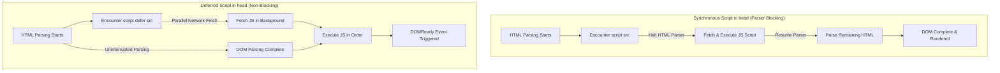

# Script Placement & Execution Strategies

> **Classification:** `JavaScript / 01-Fundamentals`  
> **Primary Reference:** [HTML Living Standard - The Script Element](https://html.spec.whatwg.org/multipage/scripting.html#the-script-element) & [MDN Web Docs - <script>](https://developer.mozilla.org/en-US/docs/Web/HTML/Element/script)  
> **Target Audience:** Web Developers & Frontend Engineers  

---

## 1. Core Concept

The `<script>` tag is the standard HTML element used to embed or reference executable JavaScript code within a Web document. How and where a script is loaded—whether placed inline, internally inside `<head>` or `<body>`, or loaded externally via `src` attributes—determines browser HTML parsing behavior, network fetch priorities, DOM availability, and page rendering speed.

Modern web performance architecture favors **external script modularization** combined with non-blocking attribute directives (`defer` and `async`) to decouple script execution from document parsing.

---

## 2. Script Execution Flow & Parsing Behavior

The browser's HTML parser processes documents sequentially from top to bottom. When a standard synchronous `<script>` tag is encountered, the parser halts HTML rendering until the script is downloaded, compiled, and executed.



---

## 3. Script Inclusion Methods & Placement Options

### 3.1 Internal Script Placement (`<head>` vs `<body>`)

JavaScript can be embedded directly within HTML using internal `<script>` blocks. Placement impacts element availability:

```html
<!DOCTYPE html>
<html lang="en">
<head>
    <meta charset="UTF-8">
    <title>Internal Script Placement</title>

    <!-- Script in <head>: Runs BEFORE DOM body is constructed -->
    <script>
        // Utility functions or early configurations
        function getAppConfig() {
            return { version: "1.0.0", env: "production" };
        }
    </script>
</head>
<body>

    <h1 id="page-heading">Welcome</h1>

    <!-- Script at end of <body>: Runs AFTER DOM nodes are instantiated -->
    <script>
        // DOM nodes are guaranteed to exist here without throwing null errors
        document.getElementById("page-heading").textContent = "Dashboard Initialized";
    </script>
</body>
</html>
```

---

### 3.2 External Script References (`src` Attribute)

Linking external JavaScript files cleanly isolates logic from document structure, improves code maintainability, and enables browser HTTP caching.

```html
<!-- Relative path reference (same directory) -->
<script src="app.js" defer></script>

<!-- Subdirectory reference -->
<script src="assets/js/utils.js" defer></script>

<!-- Absolute URL reference (CDN / Remote Host) -->
<script src="https://cdn.example.com/libs/chart.min.js" defer></script>
```

---

### 3.3 Asynchronous Loading: `async` vs `defer`

Attributes applied to external scripts alter network fetch and execution timing relative to HTML document parsing:

| Attribute | Download Behavior | Execution Timing | Execution Order | Recommended Use Case |
| :--- | :--- | :--- | :--- | :--- |
| **None (Default)** | Blocks HTML Parser | Immediately after download completes | Sequential (top-to-bottom) | Legacy scripts or essential polyfills |
| `defer` | Parallel with HTML Parser | After HTML parsing completes, before `DOMContentLoaded` | Preserves specified document order | Application bundles, main app logic, DOM modifiers |
| `async` | Parallel with HTML Parser | Immediately after download completes (pauses parser) | Independent (executes as soon as downloaded) | Analytics, ad scripts, independent tracking tools |

```mermaid
gantt
    title Browser Script Attribute Matrix
    dateFormat X
    axisFormat %s

    section Default (script)
    HTML Parsing         :active, p1, 0, 30
    Download & Exec JS   :crit, e1, 30, 70
    Resume HTML Parsing  :active, p2, 70, 100

    section Async (script async)
    HTML Parsing         :active, ap1, 0, 40
    Download JS (Bg)     :done, ad1, 0, 40
    Pause & Exec JS      :crit, ae1, 40, 60
    Resume HTML Parsing  :active, ap2, 60, 100

    section Defer (script defer)
    HTML Parsing (Full)  :active, dp1, 0, 80
    Download JS (Bg)     :done, dd1, 0, 50
    Execute JS           :crit, de1, 80, 100
```



---

## 4. Key Takeaways & Common Pitfalls

> [!NOTE]
> **HTTP Caching Advantage:** External `.js` files are cached locally by web browsers after the initial request. Subsequent page navigation loads JavaScript directly from browser cache, dramatically reducing HTTP overhead and page load latency.

> [!WARNING]
> **Avoid `async` for Dependent Code:** `async` scripts execute non-deterministically as soon as they finish downloading. If `main.js` depends on a library loaded via `async`, `main.js` will throw `ReferenceError` if it executes before the library arrives. Use `defer` for script dependencies.

> [!TIP]
> **Modern Performance Best Practice:** Place external scripts in the `<head>` tag accompanied by the `defer` attribute. This allows the browser scanner to initiate script downloads in parallel during early HTML parsing without blocking DOM tree construction.

---

## 5. Technical References & External Reading

* 📖 [MDN Web Docs - The Script Element](https://developer.mozilla.org/en-US/docs/Web/HTML/Element/script)
* 📜 [WHATWG HTML Specification - Scripting](https://html.spec.whatwg.org/multipage/scripting.html)
* ⚡ [Google Web Fundamentals - Efficiently Load JavaScript](https://web.dev/articles/efficiently-load-third-party-javascript)

---

<div align="center">

<a href="https://ashwanitiwari.com/portfolio">
  
</a>

<br />

**Documented & Maintained by [Ashwani Tiwari](https://ashwanitiwari.com)**  
*Explore full-stack architecture, projects, and client work at [ashwanitiwari.com/portfolio](https://ashwanitiwari.com/portfolio)*

</div>
