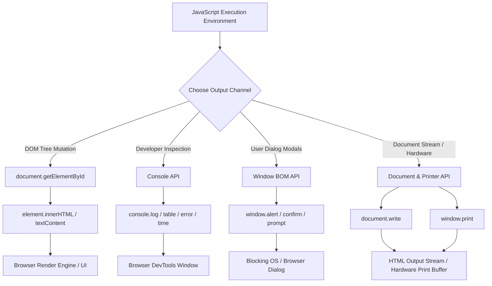

# JavaScript Data Output & Console Debugging

> **Classification:** `JavaScript / 01-Fundamentals`  
> **Primary Reference:** [Console API Standard](https://console.spec.whatwg.org/) & [MDN Web Docs - Working with Console](https://developer.mozilla.org/en-US/docs/Web/API/Console)  
> **Target Audience:** Frontend Developers & Software Engineers  

---

## 1. Core Concept

JavaScript lacks native, hardware-level output statements (like `print` in Python or `std::cout` in C++). Instead, it relies on environment-provided APIs—the **Browser Object Model (BOM)** and **Document Object Model (DOM)**—to communicate data to users and developers.

Data output in JavaScript spans four primary channels: DOM Tree element mutation, Browser DevTools debugging streams, blocking modal dialogs, and hardware print streams.

---

## 2. Data Output Pathways Architecture

The flowchart below maps how JavaScript expressions direct data output across different browser subsystem targets.



---

## 3. Output Mechanisms & Implementations

### 3.1 Writing to DOM Elements (`innerHTML` vs `textContent`)

Mutating DOM node properties is the primary mechanism for rendering dynamic content to end users.

```javascript
// Target existing HTML element node
const displayNode = document.getElementById("output-box");

// Safe text assignment (Escapes HTML characters)
displayNode.textContent = "Calculation Result: " + (45 + 55);

// HTML markup rendering
displayNode.innerHTML = "<strong>Status:</strong> <span style='color:green'>Success</span>";
```

---

### 3.2 Developer Console API (`console` Object)

The `console` object sends diagnostic messages directly to browser Developer Tools. It does not affect page layout.

```javascript
// Basic logging
console.log("Standard info log:", { userId: 101, status: "Active" });

// Tabular representation of arrays & objects
const users = [
    { id: 1, name: "Alice", role: "Admin" },
    { id: 2, name: "Bob", role: "Developer" }
];
console.table(users);

// Warning & Error logs
console.warn("API Rate Limit Approaching");
console.error("Network Fetch Failed: 500 Server Error");

// Execution timing measurement
console.time("ArrayProcessing");
for (let i = 0; i < 1000000; i++) { /* compute */ }
console.timeEnd("ArrayProcessing"); // Logs elapsed time in ms
```

---

### 3.3 Modal Dialog Output (`window.alert`)

Modal alerts display blocking dialog boxes requiring explicit user acknowledgment before script execution resumes.

```javascript
// Display alert modal (window prefix is optional)
window.alert("Session expired. Please log in again.");

// Interactive BOM modals
const userConfirmed = window.confirm("Are you sure you want to delete this record?");
if (userConfirmed) {
    console.log("Record deleted");
}
```

---

### 3.4 Document Stream Output & Hardware Printing (`document.write` & `window.print`)

Direct document writing modifies the raw HTML output stream, while `window.print()` triggers the browser's native print dialog.

```javascript
// Triggers browser print dialog
function printReceipt() {
    window.print();
}

// WARNING: Testing only - Overwrites document if called after page load
document.write("Direct document stream output.");
```

---

## 4. Key Takeaways & Common Pitfalls

> [!WARNING]
> **`document.write()` Page Erasure:** Calling `document.write()` after an HTML document has finished parsing automatically calls `document.open()`, which **completely wipes the entire existing HTML document**. Never use `document.write()` in modern production code.

> [!NOTE]
> **Blocking Main Thread with `window.alert()`:** Browser alert dialogs block the main JavaScript execution thread, freezing UI updates, timers, and event listeners until closed. Use custom HTML/CSS modal components instead for production applications.

> [!TIP]
> **Strip Console Statements in Production Builds:** While `console.log()` is essential during development, excessive logging in production can leak sensitive data and degrade performance. Use build tools (Terser, Babel plugins) to automatically strip `console` statements during production bundling.

---

## 5. Technical References & External Reading

* 📖 [Console API Living Standard](https://console.spec.whatwg.org/)
* 📜 [MDN Web Docs - Console API Methods](https://developer.mozilla.org/en-US/docs/Web/API/Console)
* 🌐 [WHATWG HTML Living Standard - Document Writing](https://html.spec.whatwg.org/multipage/dynamic-markup-insertion.html#document.write())
* 🛠️ [MDN Web Docs - Window.print()](https://developer.mozilla.org/en-US/docs/Web/API/Window/print)

---

<div align="center">

<a href="https://ashwanitiwari.com/portfolio">
  
</a>

<br />

**Documented & Maintained by [Ashwani Tiwari](https://ashwanitiwari.com)**  
*Explore full-stack architecture, projects, and client work at [ashwanitiwari.com/portfolio](https://ashwanitiwari.com/portfolio)*

</div>
