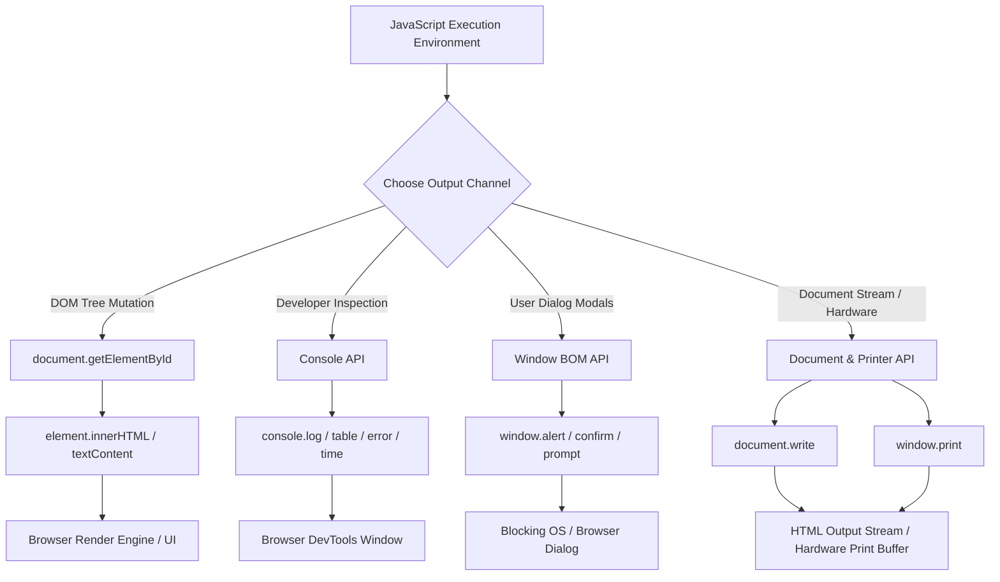

# JavaScript Data Output & Console Debugging

> **Classification:** `JavaScript / 01-Fundamentals`  
> **Primary Reference:** [Console API Standard](https://console.spec.whatwg.org/) & [MDN Web Docs - Working with Console](https://developer.mozilla.org/en-US/docs/Web/API/Console)  

---

## 1. Executive Summary

* **No Native Hardware I/O**: JavaScript lacks built-in statements like `print` or `std::cout`. Output requires environment APIs.
* **4 Output Channels**:
  1. **DOM Tree**: `innerHTML` / `textContent` (Dynamic UI update).
  2. **Console API**: `console.log` / `table` / `error` (DevTools debugging).
  3. **Window BOM**: `window.alert` / `confirm` (Blocking user modals).
  4. **Document & Hardware**: `document.write` / `window.print` (Stream / Hardware buffer).

---

## 2. Output Pathways Architecture



---

## 3. Implementations & Code Examples

<details open>
<summary><strong>💻 Click to Hide/Show Code Example: DOM Element Mutation</strong></summary>
<br>

```javascript
const displayNode = document.getElementById("output-box");

// Safe text assignment (Escapes HTML strings)
displayNode.textContent = "Calculation Result: " + (45 + 55);

// Dynamic HTML element rendering
displayNode.innerHTML = "<strong>Status:</strong> <span style='color:green'>Success</span>";
```
</details>

<details open>
<summary><strong>💻 Click to Hide/Show Code Example: Developer Console API</strong></summary>
<br>

```javascript
// Basic logging
console.log("Standard info log:", { userId: 101, status: "Active" });

// Tabular representation of arrays & objects
const users = [
    { id: 1, name: "Alice", role: "Admin" },
    { id: 2, name: "Bob", role: "Developer" }
];
console.table(users);

// Warning & Error logs
console.warn("API Rate Limit Approaching");
console.error("Network Fetch Failed: 500 Server Error");

// Execution timing measurement
console.time("ArrayProcessing");
for (let i = 0; i < 1000000; i++) { /* compute */ }
console.timeEnd("ArrayProcessing"); // Logs elapsed time in ms
```
</details>

<details open>
<summary><strong>💻 Click to Hide/Show Code Example: Modal Dialog Output</strong></summary>
<br>

```javascript
// Display alert modal (window prefix is optional)
window.alert("Session expired. Please log in again.");

// Interactive BOM modals
const userConfirmed = window.confirm("Are you sure you want to delete this record?");
if (userConfirmed) {
    console.log("Record deleted");
}
```
</details>

<details open>
<summary><strong>💻 Click to Hide/Show Code Example: Document Stream & Hardware Printing</strong></summary>
<br>

```javascript
// Triggers browser print dialog
function printReceipt() {
    window.print();
}

// WARNING: Testing only - Overwrites document if called after page load
document.write("Direct document stream output.");
```
</details>

---

## 4. Key Takeaways & Pitfalls

> [!WARNING]
> **`document.write()` Page Erasure**: Calling `document.write()` after initial page load wipes the entire document. Do not use in production.

> [!NOTE]
> **Blocking Thread via `window.alert()`**: Modal alerts freeze main-thread execution and UI events until dismissed.

> [!TIP]
> **Production Bundling**: Strip `console.log()` statements during production build bundling (via Terser / Babel plugins) to prevent data leaks.

---

## 5. Technical References

* 📖 [Console API Living Standard](https://console.spec.whatwg.org/)
* 📜 [MDN Web Docs - Console API Methods](https://developer.mozilla.org/en-US/docs/Web/API/Console)
* 🌐 [WHATWG HTML Living Standard - Document Writing](https://html.spec.whatwg.org/multipage/dynamic-markup-insertion.html#document.write())

---

<div align="center">

<a href="https://ashwanitiwari.com/portfolio">
  
</a>

<br />

**Documented & Maintained by [Ashwani Tiwari](https://ashwanitiwari.com)**  
*Explore full-stack architecture, projects, and client work at [ashwanitiwari.com/portfolio](https://ashwanitiwari.com/portfolio)*

</div>
