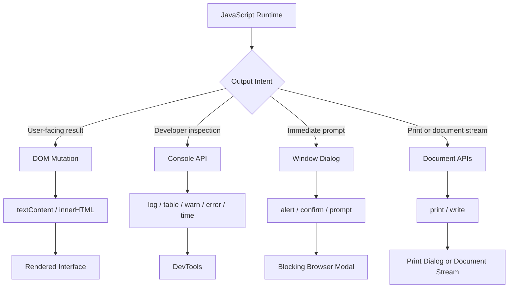

# JavaScript Data Output & Console Debugging

<div align="center">


**JavaScript output is not one feature. It is a set of environment APIs used for UI rendering, debugging, user prompts, and print workflows.**

</div>

---

## ⚡ Output Dashboard

| Channel | Primary Purpose | Best For | Production Risk |
| :--- | :--- | :--- | :--- |
| **DOM Output** | Show data in the UI | App interfaces, status messages, rendered results | Unsafe HTML injection if misused |
| **Console API** | Developer diagnostics | Logs, tables, warnings, timing | Data leaks if left noisy |
| **Window Dialogs** | Blocking user prompts | Quick demos, confirmations | Poor UX when overused |
| **Document / Print** | Stream or hardware output | Printing, legacy demos | `document.write()` can wipe the page |

> [!IMPORTANT]
> Pick the output channel based on the audience: **users need UI**, developers need **console diagnostics**, and print workflows need **browser print APIs**.

---

## 🧠 Output Architecture



---

## 🧩 Channel Selection Matrix

| Need | Use | Avoid |
| :--- | :--- | :--- |
| Display a result on the page | `textContent` or safe DOM rendering | `document.write()` |
| Debug object collections | `console.table()` | Long unstructured logs |
| Time expensive work | `console.time()` / `console.timeEnd()` | Manual timestamp guessing |
| Ask for confirmation | `confirm()` for demos only | Blocking dialogs in polished app flows |
| Print the current page | `window.print()` | Custom print hacks without print CSS |

---

## 💻 Code Lab: DOM Output

<details open>
<summary><strong>💻 Click to Hide/Show Code Example</strong></summary>
<br>

```javascript
const displayNode = document.getElementById("output-box");

// Safe text assignment (Escapes HTML strings)
displayNode.textContent = "Calculation Result: " + (45 + 55);

// Dynamic HTML element rendering
displayNode.innerHTML = "<strong>Status:</strong> <span style='color:green'>Success</span>";
```
</details>

---

## 💻 Code Lab: Console Diagnostics

<details open>
<summary><strong>💻 Click to Hide/Show Code Example</strong></summary>
<br>

```javascript
// Basic logging
console.log("Standard info log:", { userId: 101, status: "Active" });

// Tabular representation of arrays & objects
const users = [
    { id: 1, name: "Alice", role: "Admin" },
    { id: 2, name: "Bob", role: "Developer" }
];
console.table(users);

// Warning & Error logs
console.warn("API Rate Limit Approaching");
console.error("Network Fetch Failed: 500 Server Error");

// Execution timing measurement
console.time("ArrayProcessing");
for (let i = 0; i < 1000000; i++) { /* compute */ }
console.timeEnd("ArrayProcessing"); // Logs elapsed time in ms
```
</details>

---

## 💻 Code Lab: Dialog Output

<details open>
<summary><strong>💻 Click to Hide/Show Code Example</strong></summary>
<br>

```javascript
// Display alert modal (window prefix is optional)
window.alert("Session expired. Please log in again.");

// Interactive BOM modals
const userConfirmed = window.confirm("Are you sure you want to delete this record?");
if (userConfirmed) {
    console.log("Record deleted");
}
```
</details>

---

## 💻 Code Lab: Print & Document Stream

<details open>
<summary><strong>💻 Click to Hide/Show Code Example</strong></summary>
<br>

```javascript
// Triggers browser print dialog
function printReceipt() {
    window.print();
}

// WARNING: Testing only - Overwrites document if called after page load
document.write("Direct document stream output.");
```
</details>

---

## 🚦 Production Rules

> [!WARNING]
> **`document.write()` page erasure:** Calling it after load can replace the entire document. Treat it as a legacy or demo-only API.

> [!NOTE]
> **Dialog APIs block the main thread:** `alert()`, `confirm()`, and `prompt()` pause interaction until dismissed.

> [!TIP]
> **Production hygiene:** Remove noisy logs from production bundles and avoid logging secrets, tokens, user records, or payment data.

---

## ✅ Fast Recall

| Remember | Why It Matters |
| :--- | :--- |
| **Use DOM for users** | UI output belongs in the interface. |
| **Use console for developers** | Diagnostics should stay inspectable and removable. |
| **Use `textContent` by default** | It avoids accidental HTML parsing. |
| **Use `window.print()` for print** | It delegates to the browser print workflow. |

---

<div align="center">

<a href="https://ashwanitiwari.com/portfolio">
  
</a>

<br />

**Documented & Maintained by [Ashwani Tiwari](https://ashwanitiwari.com)**  
*Explore full-stack architecture, projects, and client work at [ashwanitiwari.com/portfolio](https://ashwanitiwari.com/portfolio)*

</div>
