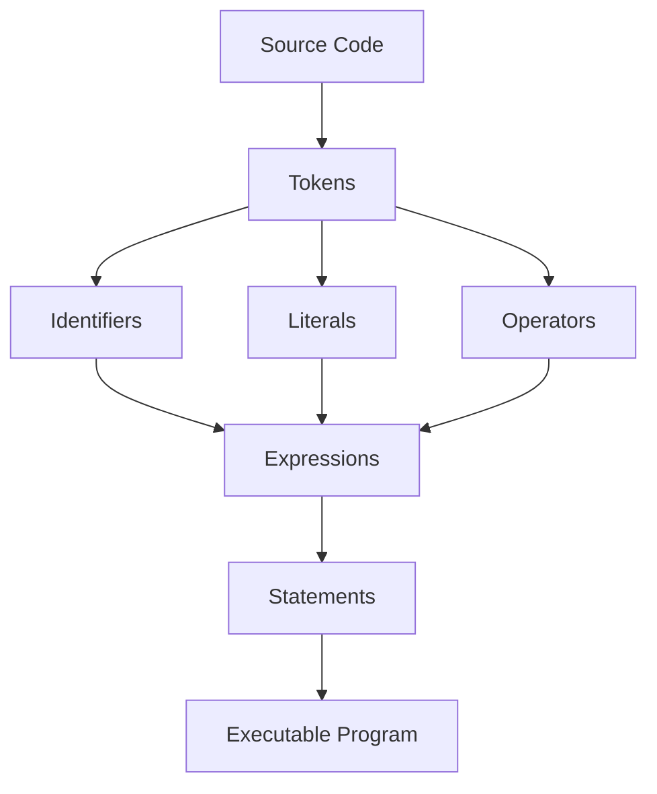

# JavaScript Syntax

<div align="center">


**JavaScript syntax is the rule system that turns values, identifiers, operators, expressions, and statements into executable browser or runtime behavior.**

</div>

---

## ⚡ Command Center

| Syntax Signal | What It Controls |
| :--- | :--- |
| **Values** | The raw data JavaScript can compute with, such as numbers, strings, booleans, objects, arrays, and functions. |
| **Literals** | Directly written values like `10.5`, `"Ashwani"`, `[1, 2, 3]`, or `{ role: "Admin" }`. |
| **Variables** | Named containers created with `let`, `const`, or legacy `var`. |
| **Identifiers** | Names assigned to variables, functions, classes, parameters, and properties. |
| **Operators & Expressions** | Symbols and combinations that compute values, assign values, compare values, or build logic. |
| **Case Rules** | JavaScript is case-sensitive, so `userName` and `username` are different identifiers. |

> [!IMPORTANT]
> Syntax is not decoration. It is the contract between your code and the JavaScript engine; tiny naming, casing, or operator mistakes can completely change runtime behavior.

---

## 🧠 Mental Model

JavaScript syntax is a pipeline: **tokens become expressions, expressions become statements, and statements become executable behavior**. A clean program is built from small valid pieces that the engine can parse without ambiguity.



---

## 🧩 Core Concepts

| Concept | Example | Purpose | Production Habit |
| :--- | :--- | :--- | :--- |
| **Literal** | `42`, `"Hello"`, `true` | Represents a direct value in source code. | Use clear literals for simple constants and examples. |
| **Variable** | `let score = 95;` | Stores a value behind a reusable name. | Prefer `const` unless reassignment is required. |
| **Identifier** | `totalPrice` | Names a variable, function, class, or parameter. | Use lower camel case for variables and functions. |
| **Keyword** | `let`, `const`, `if` | Reserved language word with special meaning. | Never use reserved keywords as custom names. |
| **Operator** | `+`, `=`, `*`, `===` | Performs assignment, arithmetic, comparison, or logic. | Use strict comparison with `===` and `!==`. |
| **Expression** | `(subtotal + tax) * 100` | Produces a value. | Keep complex expressions readable with intermediate names. |

---

## 🧭 Identifier Rules

| Rule | Valid | Invalid |
| :--- | :--- | :--- |
| Start with a letter, `_`, or `$` | `userName`, `_cache`, `$button` | `1user` |
| Use digits after the first character | `user1`, `item25` | `25items` |
| Avoid reserved keywords | `userRole`, `orderTotal` | `let`, `const`, `if` |
| Respect case sensitivity | `lastName` and `lastname` are different | Assuming both names are the same |
| Prefer lower camel case | `firstName`, `totalAmount` | `first-name` |

> [!WARNING]
> Hyphens are not valid inside JavaScript variable names. `first-name` is parsed as subtraction, not as a single identifier.

---

## 💻 Code Lab: Values, Literals & Variables

<details open>
<summary><strong>💻 Click to Hide/Show Code Example</strong></summary>
<br>

```javascript
const productName = "Wireless Keyboard";
const unitPrice = 2499;
let stockCount = 18;

const isAvailable = stockCount > 0;

console.log(productName);
console.log(unitPrice);
console.log(isAvailable);
```
</details>

---

## 💻 Code Lab: Operators & Expressions

<details open>
<summary><strong>💻 Click to Hide/Show Code Example</strong></summary>
<br>

```javascript
const subtotal = 1200;
const taxRate = 0.18;
const discount = 150;

const taxAmount = subtotal * taxRate;
const finalTotal = subtotal + taxAmount - discount;

console.log("Final Total:", finalTotal);
```
</details>

---

## 💻 Code Lab: Case Sensitivity

<details open>
<summary><strong>💻 Click to Hide/Show Code Example</strong></summary>
<br>

```javascript
const lastName = "Tiwari";
const lastname = "Sharma";

console.log(lastName);  // Tiwari
console.log(lastname);  // Sharma
```
</details>

---

## 💻 Code Lab: Naming Style

<details open>
<summary><strong>💻 Click to Hide/Show Code Example</strong></summary>
<br>

```javascript
const firstName = "Ashwani";
const totalInvoiceAmount = 5499;
const isPaymentComplete = true;

function calculateFinalAmount(baseAmount, taxRate) {
    return baseAmount + baseAmount * taxRate;
}
```
</details>

---

## 🚦 Production Rules

> [!NOTE]
> **Statements perform work:** A statement can declare a variable, assign a value, call a function, branch logic, or control a loop.

> [!TIP]
> **Use `const` first:** Start with `const`, switch to `let` only when reassignment is required, and avoid `var` in modern code.

> [!WARNING]
> **Case mismatches create bugs:** `userId`, `userID`, and `userid` are three different names to the JavaScript engine.

> [!IMPORTANT]
> **Readable names beat clever names:** Syntax is easier to debug when identifiers describe business meaning, not just data shape.

---

## ✅ Fast Recall

| Remember | Why It Matters |
| :--- | :--- |
| **Syntax defines valid code structure** | The engine must parse code before it can execute it. |
| **Literals are direct values** | They are the simplest building blocks of expressions. |
| **Identifiers are case-sensitive** | Incorrect casing creates different variables. |
| **Keywords are reserved** | They cannot safely be reused as custom names. |
| **Expressions compute values** | They combine values, variables, and operators into results. |
| **Camel case is the standard variable style** | It keeps JavaScript names readable and conventional. |

---

<div align="center">

<a href="https://ashwanitiwari.com/portfolio">
  
</a>

<br />

**Documented & Maintained by [Ashwani Tiwari](https://ashwanitiwari.com)**  
*Explore full-stack architecture, projects, and client work at [ashwanitiwari.com/portfolio](https://ashwanitiwari.com/portfolio)*

</div>
