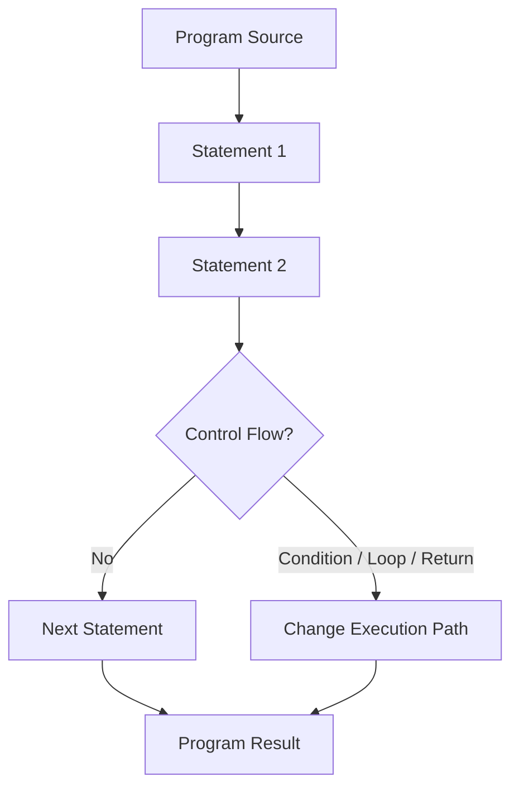

# JavaScript Statements

<div align="center">


**JavaScript statements are executable instructions that the engine runs in order to declare data, compute values, update interfaces, branch logic, and group behavior.**

</div>

---

## ⚡ Command Center

| Statement Signal | What It Controls |
| :--- | :--- |
| **Execution Order** | Statements run top-to-bottom unless control flow changes the path. |
| **Semicolons** | Separate executable statements and reduce ambiguity in edge cases. |
| **Whitespace** | Ignored by the engine in most places but essential for human readability. |
| **Line Breaks** | Safe when used carefully; best placed after operators in long expressions. |
| **Code Blocks** | Group multiple statements inside `{ ... }` for functions, conditions, loops, and error handling. |
| **Keywords** | Signal the action a statement performs, such as declaration, branching, looping, returning, or error handling. |

> [!IMPORTANT]
> A JavaScript program is a sequence of statements. Clean statement structure makes execution easier for the engine and intent easier for developers.

---

## 🧠 Mental Model

Think of statements as the **instruction rows** of a program. Each row tells JavaScript to perform one meaningful action: declare, assign, compute, call, branch, loop, return, or handle failure.



---

## 🧩 Core Concepts

| Concept | Example | Purpose | Production Habit |
| :--- | :--- | :--- | :--- |
| **Declaration Statement** | `let total;` | Creates a binding for later use. | Initialize close to first use when possible. |
| **Assignment Statement** | `total = price + tax;` | Stores a computed value. | Keep assignment intent obvious. |
| **Expression Statement** | `saveOrder(order);` | Executes an expression for its effect. | Avoid hidden side effects in complex expressions. |
| **Block Statement** | `{ statementA; statementB; }` | Groups statements together. | Always indent block contents consistently. |
| **Control Statement** | `if`, `for`, `switch` | Changes execution path. | Keep branching shallow and readable. |
| **Return Statement** | `return result;` | Exits a function with a value. | Return early for guard clauses when it improves clarity. |

---

## 📐 Formatting Rules

| Rule | Preferred | Avoid |
| :--- | :--- | :--- |
| End executable statements clearly | `const total = price + tax;` | Relying on unclear automatic insertion |
| Use readable spacing | `let x = y + z;` | `let x=y+z;` |
| Break long lines after operators | `element.textContent =` then next line | Breaking in a confusing middle position |
| Group related work in blocks | `function render() { ... }` | Loose repeated statements with no boundary |
| Use keywords only for language actions | `const value = 10;` | Custom names like `return` or `if` |

> [!TIP]
> Format code for the next reader, not only for the parser. The engine ignores many spaces; humans do not.

---

## 💻 Code Lab: Ordered Statements

<details open>
<summary><strong>💻 Click to Hide/Show Code Example</strong></summary>
<br>

```javascript
let x, y, z;

x = 5;
y = 6;
z = x + y;

console.log(z);
```
</details>

---

## 💻 Code Lab: DOM Update Statement

<details open>
<summary><strong>💻 Click to Hide/Show Code Example</strong></summary>
<br>

```javascript
document.getElementById("demo").innerHTML = "Dashboard ready.";
```
</details>

---

## 💻 Code Lab: Semicolons & Spacing

<details open>
<summary><strong>💻 Click to Hide/Show Code Example</strong></summary>
<br>

```javascript
let a, b, c;

a = 5;
b = 6;
c = a + b;

console.log(c);
```
</details>

---

## 💻 Code Lab: Code Blocks

<details open>
<summary><strong>💻 Click to Hide/Show Code Example</strong></summary>
<br>

```javascript
function updateDashboard() {
    document.getElementById("demo1").innerHTML = "Status: Active";
    document.getElementById("demo2").innerHTML = "Queue: Clear";
}

updateDashboard();
```
</details>

---

## 🚦 Production Rules

> [!NOTE]
> **Statements execute sequentially:** Unless a condition, loop, function call, exception, or return changes the path, JavaScript runs statements in written order.

> [!TIP]
> **Use semicolons consistently:** JavaScript can infer many semicolons, but explicit semicolons make statement boundaries clearer.

> [!WARNING]
> **Do not compress unrelated statements onto one line:** `a = 5; b = 6; c = a + b;` is valid, but it is harder to scan and easier to damage during edits.

> [!IMPORTANT]
> **Keywords are reserved:** Words like `let`, `const`, `if`, `switch`, `for`, `function`, `return`, and `try` define language behavior and should not be used as custom names.

---

## ✅ Fast Recall

| Remember | Why It Matters |
| :--- | :--- |
| **Statements are instructions** | They are the executable units of a JavaScript program. |
| **Order matters** | Later statements can depend on earlier declarations and assignments. |
| **Semicolons clarify boundaries** | They reduce ambiguity and improve consistency. |
| **Whitespace supports readability** | The parser may ignore it, but maintainers rely on it. |
| **Blocks group intent** | Curly braces bind related statements into one unit. |
| **Keywords define actions** | They tell the engine what kind of statement is being executed. |

---

<div align="center">

<a href="https://ashwanitiwari.com/portfolio">
  
</a>

<br />

**Documented & Maintained by [Ashwani Tiwari](https://ashwanitiwari.com)**  
*Explore full-stack architecture, projects, and client work at [ashwanitiwari.com/portfolio](https://ashwanitiwari.com/portfolio)*

</div>
