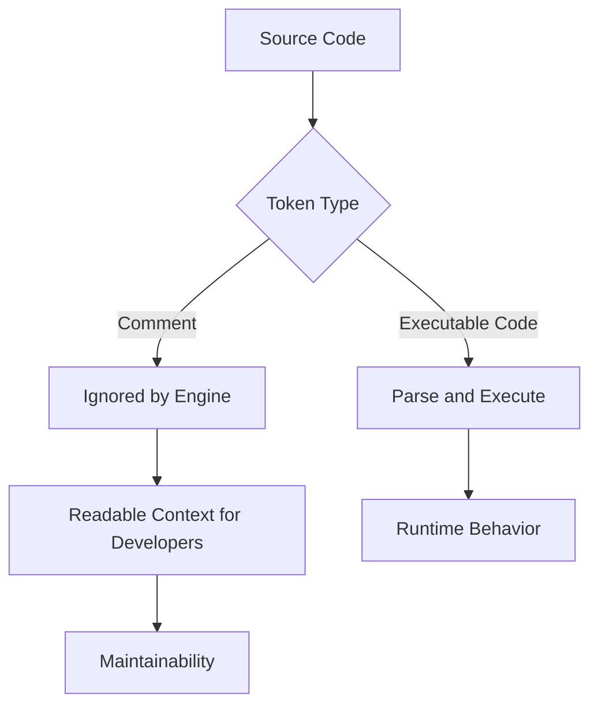

# JavaScript Comments

<div align="center">


**JavaScript comments are non-executed notes that clarify intent, document decisions, and help developers safely isolate code while testing.**

</div>

---

## ⚡ Command Center

| Comment Signal | What It Controls |
| :--- | :--- |
| **Single-Line Comments** | Use `//` to ignore everything from that marker to the end of the line. |
| **Multi-Line Comments** | Use `/* ... */` to ignore a block of text across one or many lines. |
| **Readability** | Explain why code exists, not every obvious operation it performs. |
| **Testing Control** | Temporarily prevent a line or block from executing during quick experiments. |
| **Documentation** | Mark assumptions, edge cases, constraints, and important implementation decisions. |
| **Code Hygiene** | Comments should stay accurate as the code changes. |

> [!IMPORTANT]
> A good comment reduces future confusion. A stale comment creates false confidence, which is worse than no comment.

---

## 🧠 Mental Model

Comments are removed from the execution path before runtime behavior matters. The JavaScript engine ignores them, but developers rely on them to understand intent, risk, and context.



---

## 🧩 Core Concepts

| Concept | Syntax | Best Use | Avoid |
| :--- | :--- | :--- | :--- |
| **Single-Line Comment** | `// message` | Short notes, inline context, temporary one-line testing. | Repeating what the next line already says. |
| **Block Comment** | `/* message */` | Longer explanations, formal documentation, disabled blocks. | Nesting block comments inside block comments. |
| **Inline Comment** | `const total = x + y; // context` | Brief clarification beside a statement. | Long explanations that push code off-screen. |
| **Intent Comment** | `// Keep this sync with cache keys` | Explaining why a decision exists. | Describing obvious syntax. |
| **Temporary Comment-Out** | `// runExperiment();` | Short testing windows. | Leaving dead code in committed production notes. |

---

## 📐 Commenting Strategy

| Situation | Comment Type | Example Intent |
| :--- | :--- | :--- |
| Explain a business rule | Single-line or block | Why a calculation excludes a value. |
| Mark a tricky edge case | Single-line | Why a guard condition exists. |
| Disable one test line | Single-line | Prevent one statement from running. |
| Disable multiple statements | Block | Compare alternate implementations quickly. |
| Document a function contract | Block | Explain inputs, output, and constraints. |

> [!TIP]
> Prefer comments that explain **why**. Clean names and simple structure should explain most of the **what**.

---

## 💻 Code Lab: Single-Line Comments

<details open>
<summary><strong>💻 Click to Hide/Show Code Example</strong></summary>
<br>

```javascript
// Change heading content.
document.getElementById("myH").innerHTML = "My First Page";

// Change paragraph content.
document.getElementById("myP").innerHTML = "My first paragraph.";
```
</details>

---

## 💻 Code Lab: Inline Comments

<details open>
<summary><strong>💻 Click to Hide/Show Code Example</strong></summary>
<br>

```javascript
let x = 5;      // Initial score
let y = x + 2;  // Add bonus points

console.log(y);
```
</details>

---

## 💻 Code Lab: Multi-Line Comments

<details open>
<summary><strong>💻 Click to Hide/Show Code Example</strong></summary>
<br>

```javascript
/*
The code below updates the primary heading
and supporting paragraph inside the page.
*/
document.getElementById("myH").innerHTML = "My First Page";
document.getElementById("myP").innerHTML = "My first paragraph.";
```
</details>

---

## 💻 Code Lab: Prevent Execution During Testing

<details open>
<summary><strong>💻 Click to Hide/Show Code Example</strong></summary>
<br>

```javascript
// document.getElementById("myH").innerHTML = "My First Page";
document.getElementById("myP").innerHTML = "My first paragraph.";
```
</details>

<details open>
<summary><strong>💻 Click to Hide/Show Code Example</strong></summary>
<br>

```javascript
/*
document.getElementById("myH").innerHTML = "My First Page";
document.getElementById("myP").innerHTML = "My first paragraph.";
*/
```
</details>

---

## 🚦 Production Rules

> [!NOTE]
> **Comments do not execute:** JavaScript ignores comment text during execution, so comments cannot change runtime behavior unless they hide executable code.

> [!TIP]
> **Use comments for intent:** Explain constraints, assumptions, business rules, and non-obvious decisions.

> [!WARNING]
> **Remove dead commented code:** Temporary comment-outs are useful while testing, but committed dead code makes files noisy and confusing.

> [!IMPORTANT]
> **Keep comments synchronized:** When code changes, update nearby comments in the same edit or remove them.

---

## ✅ Fast Recall

| Remember | Why It Matters |
| :--- | :--- |
| **`//` comments one line** | Everything after it on that line is ignored. |
| **`/* ... */` comments a block** | Useful for longer notes or disabling multiple lines. |
| **Comments improve readability** | They give context that code alone may not show. |
| **Comments can disable code** | Helpful for quick testing, risky if left behind. |
| **Stale comments mislead** | Wrong documentation slows debugging. |
| **Explain why, not obvious what** | Better names and structure should carry basic meaning. |

---

<div align="center">

<a href="https://ashwanitiwari.com/portfolio">
  
</a>

<br />

**Documented & Maintained by [Ashwani Tiwari](https://ashwanitiwari.com)**  
*Explore full-stack architecture, projects, and client work at [ashwanitiwari.com/portfolio](https://ashwanitiwari.com/portfolio)*

</div>
