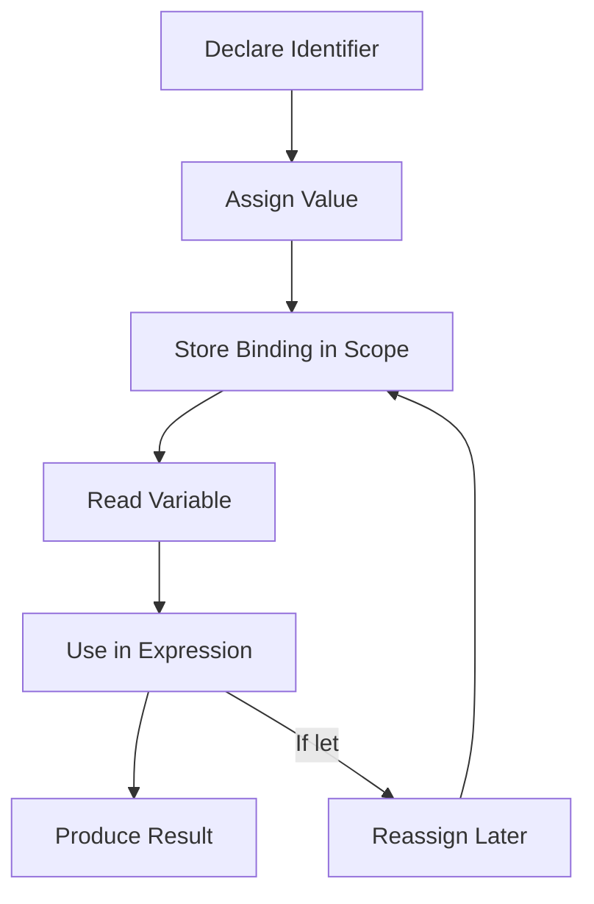

# JavaScript Variables

<div align="center">


**JavaScript variables are named containers for storing, reading, and updating values throughout a program.**

</div>

---

## ⚡ Command Center

| Variable Signal | What It Controls |
| :--- | :--- |
| **Declaration** | Creates a named binding with `const`, `let`, or legacy `var`. |
| **Assignment** | Stores a value into a variable using the `=` assignment operator. |
| **Identifier** | Defines the variable name used to reference stored data. |
| **Mutability** | `const` prevents reassignment; `let` allows reassignment. |
| **Data Type** | Variables can hold numbers, strings, booleans, objects, arrays, functions, and more. |
| **Scope Discipline** | Explicit declarations prevent accidental globals and hidden state. |

> [!IMPORTANT]
> Use variables to give meaning to data. The name should explain the value's role better than a raw literal ever could.

---

## 🧠 Mental Model

A variable is a **named reference to a stored value**. The declaration creates the name, the assignment stores the value, and later expressions read that value to compute new results.



---

## 🧩 Core Concepts

| Concept | Example | Purpose | Production Habit |
| :--- | :--- | :--- | :--- |
| **`const`** | `const taxRate = 0.18;` | Declares a binding that cannot be reassigned. | Use by default for stable values. |
| **`let`** | `let total = 0;` | Declares a binding that can be reassigned. | Use only when the value must change. |
| **`var`** | `var count = 1;` | Legacy variable declaration. | Avoid in modern JavaScript. |
| **Automatic Global** | `x = 5;` | Creates implicit state in loose mode. | Never rely on undeclared variables. |
| **Identifier** | `orderTotal` | Names the stored value. | Use clear lower camel case. |
| **Assignment** | `total = total + 5;` | Replaces a variable's current value. | Remember `=` assigns; it does not compare. |

---

## 🧭 Declaration Decision Matrix

| Need | Use | Reason |
| :--- | :--- | :--- |
| Value should not be reassigned | `const` | Best default; communicates stability. |
| Value must be reassigned | `let` | Designed for changing local state. |
| Legacy compatibility only | `var` | Function-scoped and easier to misuse. |
| No declaration keyword | Never | Creates fragile accidental globals in non-strict contexts. |

> [!TIP]
> Start every variable decision with `const`. Move to `let` only when reassignment is genuinely required.

---

## 📐 Identifier Rules

| Rule | Valid | Invalid |
| :--- | :--- | :--- |
| Start with a letter, `_`, or `$` | `userName`, `_cache`, `$button` | `1user` |
| Use numbers after the first character | `price2`, `item100` | `100items` |
| Respect case sensitivity | `totalPrice` and `totalprice` are different | Treating both as the same name |
| Avoid reserved keywords | `userRole`, `orderStatus` | `const`, `let`, `return` |
| Prefer descriptive names | `cartTotal`, `customerName` | `x`, `y`, `z` outside tiny examples |

---

## 💻 Code Lab: `let` Variables

<details open>
<summary><strong>💻 Click to Hide/Show Code Example</strong></summary>
<br>

```javascript
let x = 5;
let y = 6;
let z = x + y;

console.log(z);
```
</details>

---

## 💻 Code Lab: `const` Values

<details open>
<summary><strong>💻 Click to Hide/Show Code Example</strong></summary>
<br>

```javascript
const price1 = 5;
const price2 = 6;
let total = price1 + price2;

console.log(total);
```
</details>

---

## 💻 Code Lab: Declaration Then Assignment

<details open>
<summary><strong>💻 Click to Hide/Show Code Example</strong></summary>
<br>

```javascript
let carName;

carName = "Volvo";

console.log(carName);
```
</details>

---

## 💻 Code Lab: Identifiers With `_` and `$`

<details open>
<summary><strong>💻 Click to Hide/Show Code Example</strong></summary>
<br>

```javascript
let _lastName = "Johnson";
let _x = 2;
let _100 = 5;

let $myMoney = 5000;

console.log(_lastName, _x, _100, $myMoney);
```
</details>

---

## 💻 Code Lab: Assignment, Numbers & Strings

<details open>
<summary><strong>💻 Click to Hide/Show Code Example</strong></summary>
<br>

```javascript
let score = 10;
score = score + 5;

const fullName = "John" + " " + "Doe";
const mixedResult = "5" + 2 + 3;

console.log(score);
console.log(fullName);
console.log(mixedResult);
```
</details>

---

## 🚦 Production Rules

> [!NOTE]
> **Variables are labels for values:** A strong name makes code easier to understand before the value is even inspected.

> [!TIP]
> **Prefer one declaration per line for important values:** It improves diffs, comments, and debugging.

> [!WARNING]
> **Avoid automatic variable creation:** Assigning to an undeclared name can leak state into a wider scope and create hard-to-track bugs.

> [!IMPORTANT]
> **`=` is assignment, not equality:** Use comparison operators when checking values; use `=` only when storing values.

---

## ✅ Fast Recall

| Remember | Why It Matters |
| :--- | :--- |
| **Variables store values behind names** | Names make data reusable and meaningful. |
| **Use `const` by default** | Stable bindings reduce accidental reassignment. |
| **Use `let` for changing values** | Reassignment should be intentional and visible. |
| **Avoid `var` in modern code** | It has older scoping behavior and weaker intent. |
| **Always declare variables** | Undeclared assignments can create accidental globals. |
| **Identifiers are case-sensitive** | `price` and `Price` are different bindings. |

---

<div align="center">

<a href="https://ashwanitiwari.com/portfolio">
  
</a>

<br />

**Documented & Maintained by [Ashwani Tiwari](https://ashwanitiwari.com)**  
*Explore full-stack architecture, projects, and client work at [ashwanitiwari.com/portfolio](https://ashwanitiwari.com/portfolio)*

</div>
