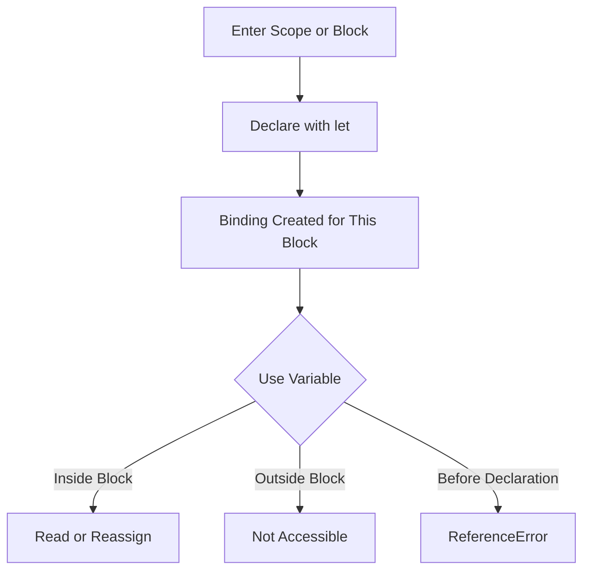

# JavaScript `let`

<div align="center">


**`let` creates block-scoped, reassignable variables that prevent same-scope redeclaration and make local state safer than legacy `var`.**

</div>

---

## ⚡ Command Center

| `let` Signal | What It Controls |
| :--- | :--- |
| **Block Scope** | A `let` variable declared inside `{ ... }` stays inside that block. |
| **Function Scope** | Inside functions, `let`, `const`, and `var` are all unavailable outside the function. |
| **Redeclaration Safety** | `let` cannot be redeclared in the same scope, reducing accidental overwrite bugs. |
| **Reassignment** | `let` values can be updated after declaration. |
| **Hoisting Behavior** | `let` is hoisted but not initialized, so using it too early throws a `ReferenceError`. |
| **Modern Usage** | Use `let` for changing values; use `const` for stable bindings. |

> [!IMPORTANT]
> `let` is for controlled change. It gives you mutable state without leaking that state outside the block that owns it.

---

## 🧠 Mental Model

Think of `let` as a variable with a **block boundary fence**. The value can change inside its allowed area, but the name cannot be accessed before declaration or redeclared in the same scope.



---

## 🧩 Core Concepts

| Concept | `let` Behavior | Why It Matters |
| :--- | :--- | :--- |
| **Block Scope** | Limited to nearest `{ ... }` block. | Prevents values from leaking out of conditionals, loops, and local blocks. |
| **Reassignment** | Allowed after declaration. | Useful for counters, accumulators, loop state, and evolving local values. |
| **Same-Scope Redeclaration** | Not allowed. | Protects existing names from accidental overwrite. |
| **Different-Block Redeclaration** | Allowed. | Separate blocks can safely own separate variables with the same name. |
| **Temporal Dead Zone** | Cannot be used before declaration. | Catches ordering bugs early. |
| **`var` Contrast** | `var` is function/global scoped. | `let` is safer for modern local state. |

---

## 📊 `var` vs `let` vs `const`

| Feature | `var` | `let` | `const` |
| :--- | :---: | :---: | :---: |
| **Scope** | Function or global | Block | Block |
| **Can Reassign** | Yes | Yes | No |
| **Can Redeclare Same Scope** | Yes | No | No |
| **Hoisted Initialization** | Initialized as `undefined` | Not initialized | Not initialized |
| **Modern Default** | Avoid | Use for changing values | Use first |

> [!TIP]
> A clean modern pattern is simple: **`const` first, `let` when reassignment is required, `var` only when maintaining legacy code.**

---

## 💻 Code Lab: Block Scope

<details open>
<summary><strong>💻 Click to Hide/Show Code Example</strong></summary>
<br>

```javascript
{
    let x = 2;
    console.log(x); // 2
}

// console.log(x); // ReferenceError: x is not defined
```
</details>

---

## 💻 Code Lab: Function Scope

<details open>
<summary><strong>💻 Click to Hide/Show Code Example</strong></summary>
<br>

```javascript
function buildSummary() {
    var legacyCount = 1;
    let activeCount = 2;
    const lockedCount = 3;

    return legacyCount + activeCount + lockedCount;
}

console.log(buildSummary());
// legacyCount, activeCount, and lockedCount are not available here.
```
</details>

---

## 💻 Code Lab: Block Redeclaration Safety

<details open>
<summary><strong>💻 Click to Hide/Show Code Example</strong></summary>
<br>

```javascript
let statusCode = 200;

{
    let statusCode = 404;
    console.log(statusCode); // 404
}

console.log(statusCode); // 200
```
</details>

---

## 💻 Code Lab: Reassignment

<details open>
<summary><strong>💻 Click to Hide/Show Code Example</strong></summary>
<br>

```javascript
let cartTotal = 0;

cartTotal = cartTotal + 499;
cartTotal = cartTotal + 1299;

console.log(cartTotal);
```
</details>

---

## 💻 Code Lab: Temporal Dead Zone

<details open>
<summary><strong>💻 Click to Hide/Show Code Example</strong></summary>
<br>

```javascript
// console.log(customerName); // ReferenceError

let customerName = "Ashwani";

console.log(customerName);
```
</details>

---

## 🚦 Production Rules

> [!NOTE]
> **`let` is block-scoped:** A variable declared inside `{ ... }` belongs to that block and should not be expected outside it.

> [!TIP]
> **Use `let` for evolving local state:** Counters, accumulators, temporary workflow values, and loop variables are natural fits.

> [!WARNING]
> **Do not redeclare in the same scope:** `let user = "A"; let user = "B";` is invalid and should be replaced with reassignment only when intentional.

> [!IMPORTANT]
> **Declare before use:** Even though `let` declarations are hoisted, they are not initialized before the declaration line.

---

## ✅ Fast Recall

| Remember | Why It Matters |
| :--- | :--- |
| **`let` is block-scoped** | It keeps local values contained. |
| **`let` can be reassigned** | Use it when a value must change. |
| **`let` cannot be redeclared in the same scope** | Prevents accidental name collisions. |
| **Different blocks can reuse names** | Each block owns its own binding. |
| **Use before declaration throws** | Helps catch ordering bugs. |
| **Prefer `const` first** | Choose `let` only when mutation is needed. |

---

<div align="center">

<a href="https://ashwanitiwari.com/portfolio">
  
</a>

<br />

**Documented & Maintained by [Ashwani Tiwari](https://ashwanitiwari.com)**  
*Explore full-stack architecture, projects, and client work at [ashwanitiwari.com/portfolio](https://ashwanitiwari.com/portfolio)*

</div>
