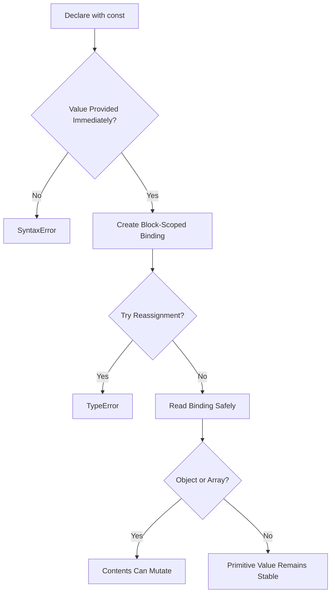

# JavaScript `const`

<div align="center">


**`const` creates block-scoped bindings that must be initialized immediately and cannot be reassigned, making intent stable and explicit.**

</div>

---

## ⚡ Command Center

| `const` Signal | What It Controls |
| :--- | :--- |
| **Required Initialization** | A `const` declaration must receive a value immediately. |
| **No Reassignment** | The binding cannot point to a different value after declaration. |
| **Block Scope** | A `const` variable belongs to the nearest `{ ... }` block. |
| **Redeclaration Safety** | The same name cannot be redeclared with `const` in the same scope. |
| **Reference Stability** | Objects and arrays keep the same reference, but their contents can still mutate. |
| **Modern Default** | Use `const` first, then switch to `let` only when reassignment is required. |

> [!IMPORTANT]
> `const` protects the binding, not always the internal contents of the value. A constant array can still receive new elements unless you also freeze or copy it defensively.

---

## 🧠 Mental Model

Think of `const` as a **locked name tag**. The name must be attached to a value at declaration time, and it cannot be attached to a different value later. For objects and arrays, the tag stays locked to the same reference, but the referenced container can still be changed.



---

## 🧩 Core Concepts

| Concept | `const` Behavior | Why It Matters |
| :--- | :--- | :--- |
| **Immediate Assignment** | `const value = 10;` is valid; `const value;` is not. | Prevents uninitialized stable bindings. |
| **No Reassignment** | `value = 20;` fails after `const value = 10;`. | Makes ownership and intent clearer. |
| **Block Scope** | Exists only inside the nearest block. | Prevents local values from leaking outward. |
| **No Same-Scope Redeclaration** | `const x = 1; const x = 2;` is invalid. | Avoids accidental name collisions. |
| **Mutable Array Contents** | `items.push("new")` is allowed. | The reference is constant, not the array internals. |
| **Mutable Object Properties** | `user.role = "admin"` is allowed. | Property mutation is different from reassignment. |

---

## 📊 `var` vs `let` vs `const`

| Feature | `var` | `let` | `const` |
| :--- | :---: | :---: | :---: |
| **Scope** | Function or global | Block | Block |
| **Must Initialize Immediately** | No | No | Yes |
| **Can Reassign** | Yes | Yes | No |
| **Can Redeclare Same Scope** | Yes | No | No |
| **Hoisted Initialization** | Initialized as `undefined` | Not initialized | Not initialized |
| **Modern Use** | Avoid | Changing values | Default choice |

---

## 💻 Code Lab: Required Initialization

<details open>
<summary><strong>💻 Click to Hide/Show Code Example</strong></summary>
<br>

```javascript
const PI = 3.14159265359;

console.log(PI);
```
</details>

---

## 💻 Code Lab: No Reassignment

<details open>
<summary><strong>💻 Click to Hide/Show Code Example</strong></summary>
<br>

```javascript
const taxRate = 0.18;

// taxRate = 0.20; // TypeError: Assignment to constant variable.

console.log(taxRate);
```
</details>

---

## 💻 Code Lab: Constant Arrays

<details open>
<summary><strong>💻 Click to Hide/Show Code Example</strong></summary>
<br>

```javascript
const cars = ["Saab", "Volvo", "BMW"];

cars[0] = "Toyota";
cars.push("Audi");

// cars = ["Toyota", "Volvo", "Audi"]; // TypeError

console.log(cars);
```
</details>

---

## 💻 Code Lab: Constant Objects

<details open>
<summary><strong>💻 Click to Hide/Show Code Example</strong></summary>
<br>

```javascript
const car = {
    type: "Fiat",
    model: "500",
    color: "white"
};

car.color = "red";
car.owner = "Johnson";

// car = { type: "Volvo", model: "EX60", color: "red" }; // TypeError

console.log(car);
```
</details>

---

## 💻 Code Lab: Block Scope

<details open>
<summary><strong>💻 Click to Hide/Show Code Example</strong></summary>
<br>

```javascript
const x = 10;

{
    const x = 2;
    console.log(x); // 2
}

console.log(x); // 10
```
</details>

---

## 🚦 Production Rules

> [!NOTE]
> **`const` is about binding stability:** It prevents reassignment of the variable name, not necessarily mutation of the referenced object or array.

> [!TIP]
> **Use `const` by default:** Most values in clean JavaScript programs do not need reassignment.

> [!WARNING]
> **Do not confuse immutability with constant reference:** `const user = {}` still allows `user.name = "Ashwani"` unless the object is frozen or copied safely.

> [!IMPORTANT]
> **Initialize immediately:** `const` without an initializer is invalid because the binding cannot be assigned later.

---

## ✅ Fast Recall

| Remember | Why It Matters |
| :--- | :--- |
| **`const` must be initialized** | The value must exist at declaration time. |
| **`const` cannot be reassigned** | The binding cannot point somewhere else. |
| **`const` is block-scoped** | It stays inside the nearest `{ ... }` boundary. |
| **Arrays can still change** | The array reference is stable, not its elements. |
| **Objects can still change** | The object reference is stable, not its properties. |
| **Prefer `const` first** | It communicates stable intent and reduces accidental mutation. |

---

<div align="center">

<a href="https://ashwanitiwari.com/portfolio">
  
</a>

<br />

**Documented & Maintained by [Ashwani Tiwari](https://ashwanitiwari.com)**  
*Explore full-stack architecture, projects, and client work at [ashwanitiwari.com/portfolio](https://ashwanitiwari.com/portfolio)*

</div>
