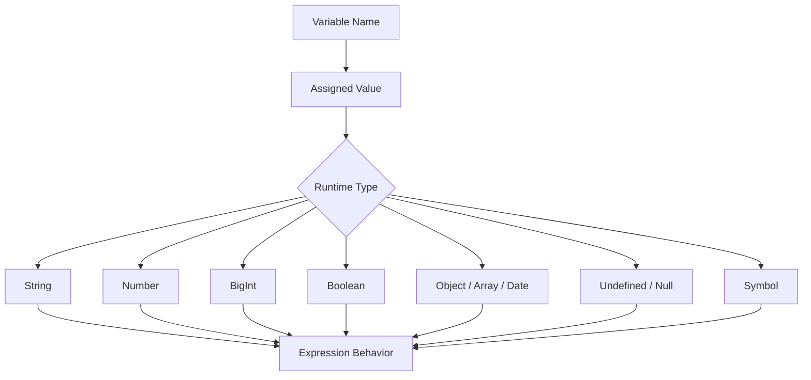

# JavaScript Data Types

<div align="center">


**JavaScript data types define what kind of value a variable currently holds and how that value behaves in expressions, comparisons, storage, and runtime logic.**

</div>

---

## ⚡ Command Center

| Type Signal | What It Controls |
| :--- | :--- |
| **Primitive Values** | Store direct immutable values such as strings, numbers, booleans, `undefined`, `null`, symbols, and BigInts. |
| **Object Values** | Store reference-based collections such as objects, arrays, dates, functions, maps, and sets. |
| **Dynamic Typing** | A variable can hold different types over its lifetime. |
| **`typeof` Inspection** | Returns a string describing the runtime type category of a value or expression. |
| **Empty vs Missing** | `""`, `undefined`, and `null` represent different states and should not be treated as identical. |
| **Comparison Behavior** | Type choices affect equality, coercion, arithmetic, and conditional logic. |

> [!IMPORTANT]
> JavaScript variables do not have fixed types; values have types. A clean program makes those value changes intentional and easy to inspect.

---

## 🧠 Mental Model

Think of a variable as a label and the assigned value as the typed payload. The label can point to a new payload later, and JavaScript determines behavior from the current value's type at runtime.



---

## 🧩 Core Concepts

| Data Type | Example | Category | Primary Use |
| :--- | :--- | :--- | :--- |
| **String** | `"Dashboard"` | Primitive | Text, labels, messages, identifiers. |
| **Number** | `42`, `3.14` | Primitive | Standard numeric calculations. |
| **BigInt** | `9007199254740993n` | Primitive | Integers larger than safe Number precision. |
| **Boolean** | `true`, `false` | Primitive | Conditions, flags, toggles, comparisons. |
| **Object** | `{ name: "Ashwani" }` | Reference | Structured key-value data. |
| **Undefined** | `let value;` | Primitive | Declared but not assigned. |
| **Null** | `let value = null;` | Primitive | Intentional absence of an object or value. |
| **Symbol** | `Symbol("id")` | Primitive | Unique identifiers and advanced object keys. |

---

## 📊 Runtime Type Matrix

| Value | `typeof` Result | Notes |
| :--- | :--- | :--- |
| `"John"` | `"string"` | Text values use quotes. |
| `3.14` | `"number"` | Integers and decimals share the same Number type. |
| `123n` | `"bigint"` | BigInt values use the `n` suffix or `BigInt()`. |
| `true` | `"boolean"` | Comparison operators produce booleans. |
| `{}` | `"object"` | Objects store reference-based structured data. |
| `[]` | `"object"` | Arrays are specialized objects. |
| `undefined` | `"undefined"` | No value has been assigned. |
| `null` | `"object"` | Historical JavaScript behavior; treat `null` as intentional absence. |
| `Symbol()` | `"symbol"` | Always creates a unique primitive identifier. |

> [!WARNING]
> `typeof null` returns `"object"` because of legacy language behavior. Do not use that result alone to distinguish real objects from `null`.

---

## 💻 Code Lab: Core Data Types

<details open>
<summary><strong>💻 Click to Hide/Show Code Example</strong></summary>
<br>

```javascript
let color = "Yellow";
let length = 16;
let weight = 7.5;
let isActive = true;
let largeId = 1234567890123456789012345n;

const person = { firstName: "John", lastName: "Doe" };
const cars = ["Saab", "Volvo", "BMW"];
const createdAt = new Date("2022-03-25");

let pendingValue;
let selectedItem = null;
const uniqueKey = Symbol("id");

console.log(color, length, weight, isActive, largeId);
console.log(person, cars, createdAt, pendingValue, selectedItem, uniqueKey);
```
</details>

---

## 💻 Code Lab: `typeof` Inspection

<details open>
<summary><strong>💻 Click to Hide/Show Code Example</strong></summary>
<br>

```javascript
console.log(typeof "John");       // string
console.log(typeof 314);          // number
console.log(typeof 3.14);         // number
console.log(typeof (3 + 4));      // number
console.log(typeof true);         // boolean
console.log(typeof undefined);    // undefined
console.log(typeof null);         // object
console.log(typeof Symbol("id")); // symbol
```
</details>

---

## 💻 Code Lab: Strings and Quotes

<details open>
<summary><strong>💻 Click to Hide/Show Code Example</strong></summary>
<br>

```javascript
let carName1 = "Volvo XC60";
let carName2 = 'Volvo XC60';

let answer1 = "It's alright";
let answer2 = "He is called 'Johnny'";
let answer3 = 'He is called "Johnny"';

console.log(carName1, carName2, answer1, answer2, answer3);
```
</details>

---

## 💻 Code Lab: Numbers and Exponential Notation

<details open>
<summary><strong>💻 Click to Hide/Show Code Example</strong></summary>
<br>

```javascript
let x1 = 34.00;
let x2 = 34;

let largeNumber = 123e5;   // 12300000
let smallNumber = 123e-5;  // 0.00123

console.log(x1, x2, largeNumber, smallNumber);
```
</details>

---

## 💻 Code Lab: Undefined, Null & Empty String

<details open>
<summary><strong>💻 Click to Hide/Show Code Example</strong></summary>
<br>

```javascript
let carName;
let selectedCar = null;
let searchQuery = "";

console.log(carName);           // undefined
console.log(selectedCar);       // null
console.log(searchQuery);       // ""
console.log(typeof searchQuery); // string
```
</details>

---

## 🚦 Production Rules

> [!NOTE]
> **Use `typeof` for quick diagnostics:** It is useful for primitives, but arrays, dates, `null`, and plain objects all need more specific checks.

> [!TIP]
> **Model missing states deliberately:** Use `undefined` for not-yet-assigned values and `null` for intentional absence.

> [!WARNING]
> **Be careful with mixed-type operations:** String concatenation and numeric addition both use `+`, so type clarity matters.

> [!IMPORTANT]
> **Arrays and dates are objects:** Use `Array.isArray(value)` for arrays and `value instanceof Date` for date objects when precision matters.

---

## ✅ Fast Recall

| Remember | Why It Matters |
| :--- | :--- |
| **JavaScript has 8 core data types** | They define how values behave at runtime. |
| **Variables are dynamically typed** | The assigned value determines the current type. |
| **Numbers include integers and decimals** | Both use the same `number` type. |
| **BigInt handles large integers** | It protects precision for very large integer values. |
| **Arrays are objects** | Use array-specific checks when needed. |
| **`undefined`, `null`, and `""` are different** | Each represents a different kind of absence or emptiness. |

---

<div align="center">

<a href="https://ashwanitiwari.com/portfolio">
  
</a>

<br />

**Documented & Maintained by [Ashwani Tiwari](https://ashwanitiwari.com)**  
*Explore full-stack architecture, projects, and client work at [ashwanitiwari.com/portfolio](https://ashwanitiwari.com/portfolio)*

</div>
