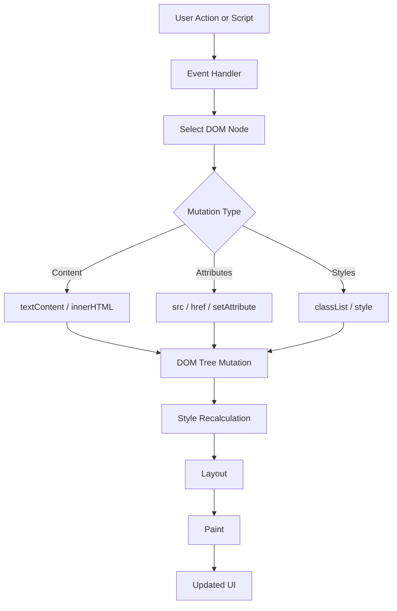

# DOM Manipulation & Element Interaction

<div align="center">


**DOM manipulation is how JavaScript turns application decisions into visible interface changes.**

</div>

---

## ⚡ DOM Control Dashboard

| Operation | API Family | Best Practice |
| :--- | :--- | :--- |
| **Select elements** | `getElementById()`, `querySelector()` | Cache repeated selections when practical. |
| **Update text** | `textContent` | Prefer for user-controlled text. |
| **Update markup** | `innerHTML` | Use only with trusted or sanitized content. |
| **Update attributes** | Properties, `setAttribute()` | Keep `alt`, `aria-*`, and state attributes accurate. |
| **Update style** | `classList`, `style` | Prefer CSS classes for maintainable UI states. |

> [!IMPORTANT]
> DOM work is visible work. Every mutation can trigger style recalculation, layout, or paint, so write DOM updates deliberately.

---

## 🧠 Runtime Mental Model



---

## 🧩 API Selection Matrix

| Goal | Preferred Tool | Watch Out For |
| :--- | :--- | :--- |
| Insert plain text | `textContent` | It escapes markup, which is usually desirable. |
| Render trusted HTML | `innerHTML` | Never feed it unsanitized user input. |
| Toggle visual state | `classList.toggle()` | Avoid scattering many inline style writes. |
| Disable controls | `disabled` or `setAttribute()` | Keep UI state and accessibility aligned. |
| Change media | `src`, `alt` | Update `alt` text when meaning changes. |

---

## 💻 Code Lab: Content Mutation

<details open>
<summary><strong>💻 Click to Hide/Show Code Example</strong></summary>
<br>

```javascript
const heading = document.getElementById("main-title");

// Safe text replacement (Recommended for plain text)
heading.textContent = "Updated Title via DOM API";

// Dynamic HTML injection
const container = document.getElementById("content-box");
container.innerHTML = "<p class='highlight'>Dynamic paragraph injected.</p>";
```
</details>

---

## 💻 Code Lab: Attribute Mutation

<details open>
<summary><strong>💻 Click to Hide/Show Code Example</strong></summary>
<br>

```javascript
const imageElement = document.getElementById("status-icon");

// Direct property assignment
imageElement.src = "assets/active-status.png";
imageElement.alt = "System Active";

// Attribute method access
const submitBtn = document.getElementById("btn-submit");
submitBtn.setAttribute("disabled", "true");
submitBtn.removeAttribute("aria-hidden");
```
</details>

---

## 💻 Code Lab: Style & Visibility

<details open>
<summary><strong>💻 Click to Hide/Show Code Example</strong></summary>
<br>

```javascript
const banner = document.getElementById("notification-banner");

// Inline CSS assignment
banner.style.backgroundColor = "#2e7d32";
banner.style.color = "#ffffff";
banner.style.padding = "12px 20px";

// Visibility Toggling
function hideElement(node) {
    node.style.display = "none"; // Hides node and removes from layout
}

function showElement(node) {
    node.style.display = "block"; // Restores node rendering layout
}
```
</details>

---

## 🚦 Production Rules

> [!NOTE]
> **Class toggling scales better:** Use CSS classes for visual states and keep JavaScript responsible for behavior.

> [!WARNING]
> **XSS risk:** `innerHTML` parses strings as markup. Treat untrusted input as text unless it has been sanitized.

> [!TIP]
> **Batch DOM updates:** Group reads and writes to reduce layout thrashing in interactive screens.

---

## ✅ Fast Recall

| Remember | Why It Matters |
| :--- | :--- |
| **DOM is a live object tree** | Changes become visible through rendering. |
| **`textContent` is safer** | It avoids accidental HTML execution paths. |
| **Classes beat inline style sprawl** | Cleaner CSS ownership and easier maintenance. |
| **Every mutation has a cost** | Performance depends on disciplined updates. |

---

<div align="center">

<a href="https://ashwanitiwari.com/portfolio">
  
</a>

<br />

**Documented & Maintained by [Ashwani Tiwari](https://ashwanitiwari.com)**  
*Explore full-stack architecture, projects, and client work at [ashwanitiwari.com/portfolio](https://ashwanitiwari.com/portfolio)*

</div>
