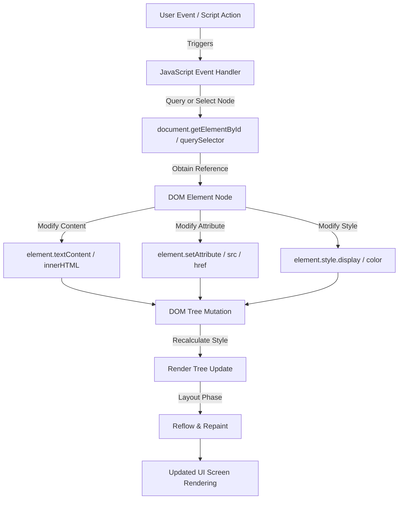

# DOM Manipulation & Element Interaction

> **Classification:** `JavaScript / 02-DOM-Manipulation`  
> **Primary Reference:** [MDN Web Docs - DOM API](https://developer.mozilla.org/en-US/docs/Web/API/Document_Object_Model) & [WHATWG DOM Living Standard](https://dom.spec.whatwg.org/)  

---

## 1. Executive Summary

* **Document Object Model (DOM)**: Object-tree representation of an HTML document provided by web browsers.
* **Dynamic Control**: JavaScript DOM API selects, reads, modifies, and deletes HTML elements and styles dynamically.
* **Client-Side Reactivity**: Event handlers intercept user actions, trigger DOM mutations, and invoke browser reflow/repaint operations.

---

## 2. Browser DOM Execution Lifecycle



---

## 3. Core Manipulation Techniques

### 3.1 Content Modification: `textContent` vs `innerHTML`

* **`textContent`**: Replaces plain node text safely. Fast, prevents XSS.
* **`innerHTML`**: Parses string as HTML markup. Requires sanitization for user input.

<details>
<summary><strong>💻 Click to Expand Code Example: Content Modification</strong></summary>
<br>

```javascript
const heading = document.getElementById("main-title");

// Safe text replacement (Recommended for plain text)
heading.textContent = "Updated Title via DOM API";

// Dynamic HTML injection
const container = document.getElementById("content-box");
container.innerHTML = "<p class='highlight'>Dynamic paragraph injected.</p>";
```
</details>

---

### 3.2 HTML Attribute Manipulation

* **Properties**: Direct node property assignments (`element.src = '...'`).
* **Methods**: Explicit attribute methods (`setAttribute()`, `removeAttribute()`).

<details>
<summary><strong>💻 Click to Expand Code Example: Attribute Manipulation</strong></summary>
<br>

```javascript
const imageElement = document.getElementById("status-icon");

// Direct property assignment
imageElement.src = "assets/active-status.png";
imageElement.alt = "System Active";

// Attribute method access
const submitBtn = document.getElementById("btn-submit");
submitBtn.setAttribute("disabled", "true");
submitBtn.removeAttribute("aria-hidden");
```
</details>

---

### 3.3 Dynamic Style & Visibility Control

* **Inline Styling**: Assign via `element.style.propertyName` (camelCase).
* **Visibility Toggling**: Control rendering layout via `display = 'none'` or `display = 'block'`.

<details>
<summary><strong>💻 Click to Expand Code Example: Style & Visibility Toggling</strong></summary>
<br>

```javascript
const banner = document.getElementById("notification-banner");

// Inline CSS assignment
banner.style.backgroundColor = "#2e7d32";
banner.style.color = "#ffffff";
banner.style.padding = "12px 20px";

// Visibility Toggling
function hideElement(node) {
    node.style.display = "none"; // Hides node and removes from layout
}

function showElement(node) {
    node.style.display = "block"; // Restores node rendering layout
}
```
</details>

---

## 4. Key Takeaways & Pitfalls

> [!NOTE]
> **Class Toggling Over Inline Styles**: Use `element.classList.add()` or `.toggle()` to keep visual styles inside CSS files.

> [!WARNING]
> **XSS Vulnerability**: Avoid assigning unsanitized user strings to `innerHTML`. Use `textContent` for security.

> [!TIP]
> **Batch DOM Updates**: Minimize layout thrashing by grouping DOM reads and writes separately or using `DocumentFragment`.

---

## 5. Technical References

* 📖 [MDN Web Docs - Introduction to the DOM](https://developer.mozilla.org/en-US/docs/Web/API/Document_Object_Model/Introduction)
* 📜 [WHATWG DOM Living Standard Specification](https://dom.spec.whatwg.org/)
* 🔒 [OWASP - Cross-Site Scripting (XSS) Prevention](https://cheatsheetseries.owasp.org/cheatsheets/Cross_Site_Scripting_Prevention_Cheat_Sheet.html)

---

<div align="center">

<a href="https://ashwanitiwari.com/portfolio">
  
</a>

<br />

**Documented & Maintained by [Ashwani Tiwari](https://ashwanitiwari.com)**  
*Explore full-stack architecture, projects, and client work at [ashwanitiwari.com/portfolio](https://ashwanitiwari.com/portfolio)*

</div>
